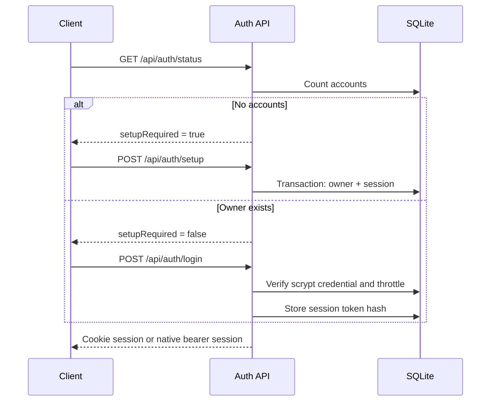
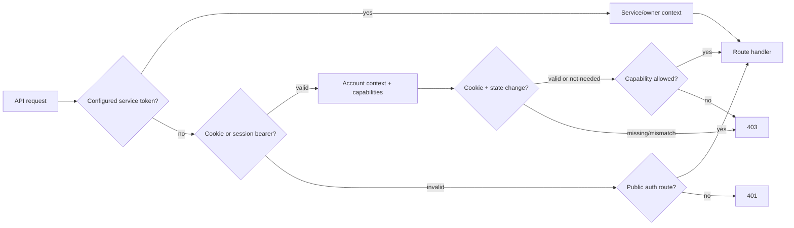

# Accounts

Nebula accounts are local to one self-hosted server. They protect the dashboard
and API without requiring an external identity provider, while keeping the
media library shared between users.

## Design Philosophy

Accounts should feel like selecting a profile on a console: deliberate on first
run, quick on return, visible but quiet during normal use, and recoverable when
a session expires. Security boundaries live on the server. The client may hide
commands for clarity, but it is never the authority.

## Implemented Model

Each account has a UUID, normalized username, display name, role, password
credential, disabled flag, timestamps, last-login time, and JSON preferences.
Sessions have independent UUIDs, hashed random tokens, CSRF secrets, client
labels, creation/last-seen/expiration timestamps, and optional revocation time.

Roles map to centralized capabilities:

| Capability | Owner | Member |
| --- | --- | --- |
| Use dashboard, Search, Cinema, and Studio | Yes | Yes |
| Manage personal watchlist/profile/sessions | Yes | Yes |
| Browse and download shared Files | Yes | Yes |
| Upload, rename, create, and delete Files | Yes | No |
| Edit shared Cinema metadata or run identification | Yes | No |
| Administer server | Yes | No |

The first account is always `owner`. Owners can create and enable/disable member
accounts after setup. Version one does not support promoting another owner,
changing roles, or deleting accounts.

## Persistence

The server uses Node 25's built-in `node:sqlite` module. This avoids native npm
addons on Alpine while providing transactions, constraints, WAL journaling,
foreign keys, and durable schema migrations. The database defaults to
`/app/data/nebula.sqlite`, in a Compose named volume, not `content/` or tracked
source. `NEBULA_DATA_ROOT` can select another server-owned directory.

Migrations use SQLite `PRAGMA user_version` and run in a transaction. Version 1
creates users, sessions, login-attempt throttling, personal watchlists, and
media access tickets. Database, WAL, and SHM files are ignored and must never be
committed or copied into a client bundle.

## Authentication Flow

## Password And Session Security

- Passwords use `scrypt` with a random 16-byte salt, `N=32768`, `r=8`, `p=1`,
  a 32-byte derived key, and constant-time verification.
- Passwords are 12-128 characters; usernames and profile fields are bounded.
- Login responses use the same generic error for unknown usernames, wrong
  passwords, and disabled accounts. A dummy hash equalizes the unknown-user
  path.
- Failed login attempts are throttled by normalized username and remote address
  using bounded windows stored in SQLite.
- Session tokens and media tickets are 32 cryptographically random bytes. Only
  SHA-256 hashes are stored server-side.
- Browser sessions use an HttpOnly, SameSite=Lax cookie. The cookie is Secure
  when the direct request is HTTPS. Cookie-authenticated mutations require the
  session CSRF token in `X-Nebula-CSRF`.
- Password changes revoke every other session and rotate the current session.
- Logout and session deletion revoke immediately. Expired and disabled-account
  sessions fail closed.
- Secrets, credentials, hashes, and tokens are never intentionally logged.

## Browser, Capacitor, And Media

Same-origin browsers receive a cookie and an in-memory CSRF value. The CSRF
value is restored through `GET /api/auth/me`; it is not an authentication
secret by itself.

Capacitor sends `clientType: "native"` during setup/login and receives the raw
session token once. The current client stores it in local storage, scoped by
Server URL so a token is not sent when switching servers, because this
framework-free scaffold has no Keychain bridge. This is an explicit version-one
limitation; a production native client should move it to Keychain-backed secure
storage. Native requests send `Authorization: Bearer <session token>` and do not
require CSRF.

HTML media elements cannot attach bearer headers. An authenticated library
request therefore receives narrow media URLs containing random, hashed,
revocable tickets bound to one user, media kind, and content path. Tickets have
a limited lifetime and authorize only GET/HEAD byte-range streaming; they are
not session credentials and cannot call JSON or Files APIs.

CORS stays API-only and allowlisted. Credentials are enabled only for an
explicitly allowed origin, and no arbitrary origin is reflected.

## Per-User And Shared State

- Cinema watchlists are per-user in SQLite.
- Account preferences and active devices/sessions are per-user in SQLite.
- Cinema metadata remains server-shared and owner-writable.
- Studio queue/history remain client-memory state in version one.
- Files remain a shared namespace. Members may browse/download; owners may
  mutate it.
- Search history is not persisted.
- Server URL and legacy API token remain device-local client settings. Native
  account session tokens are also device-local until Keychain integration.

On the first owner's initial Cinema library read, legacy `watchlisted: true`
values from `content/.cinema-metadata.json` are copied into that owner's
watchlist in a transaction. Member migration markers are recorded without
copying the shared preference. The legacy field is retained for backward
compatibility, while account responses are overlaid from the personal table.

## Compatibility And Migration

After upgrade, a server with no account database enters deliberate owner setup;
there is no default password. Public setup closes atomically after the first
account is committed. Existing `NEBULA_API_TOKEN` credentials remain accepted
as an owner-capability service path when configured. `NEBULA_REQUIRE_AUTH` and
the socket-address-only localhost exemption remain supported for service-token
deployments; account setup itself is never silently bypassed in the UI.

Existing media and Cinema metadata remain in place. Container recreation keeps
the account database through the `nebula-data` volume. A database backup should
copy the SQLite database together with its WAL state using SQLite's backup
facilities or while the server is stopped.

## Threat Analysis

| Threat | Primary mitigation | Residual risk |
| --- | --- | --- |
| Credential theft | HttpOnly cookie; hashed native token at rest server-side | Native token is in WebView local storage in v1 |
| CSRF | SameSite=Lax plus per-session header token | Compromised same-origin script defeats CSRF controls |
| Brute force / enumeration | Generic failure, dummy hash, persisted throttling | Distributed low-rate attacks remain possible |
| Database disclosure | Scrypt passwords; hashed sessions/tickets | Profile and activity metadata remain readable |
| Stolen session | Expiration, device list, revocation, password rotation | No automated anomaly detection |
| Media URL leakage | Narrow, expiring, path-bound ticket | Ticket works until expiry/revocation for its one file |
| Privilege escalation | Central route capabilities, server-side checks | Owner compromise grants full local administration |
| Setup race | SQLite immediate transaction and unique owner invariant | Physical database access remains trusted |
| CORS abuse | Explicit allowlist, API-only headers | A compromised allowed origin is trusted |

## Version-One Limitations

- No password reset, email address, MFA, passkeys, or external identity.
- No account deletion, role changes, or second-owner promotion.
- Member passwords are owner-assigned at creation; forced first-login password
  change is not yet implemented.
- One role per account; no library/folder-level ACLs.
- No encrypted database-at-rest support.
- Native bearer storage is not yet Keychain-backed.
- Direct HTTP development cannot set a Secure cookie; production should use
  HTTPS.
- Studio queue/history and Search history are not server-persistent.
- Session device labels are user-agent-derived and are not cryptographically
  attested.
