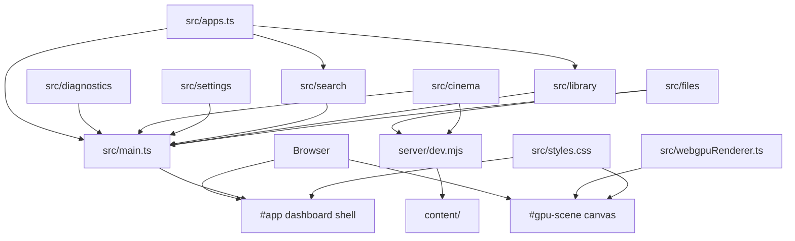

# Architecture

Nebula Dashboard is currently a small framework-free TypeScript app served by
Vite. It is intentionally simple while the shell concepts are still forming.

## Layers



## File Responsibilities

`src/main.ts`

- Builds the shell markup.
- Renders app tiles and detail panels.
- Handles keyboard and pointer input.
- Manages app-first dashboard navigation.
- Launches focused apps into the full-screen app surface.
- Starts the WebGPU renderer.

`src/apps.ts`

- Defines `DashboardApp`.
- Stores app metadata.
- Is the first place to add/remove dashboard apps.

`src/webgpuRenderer.ts`

- Requests WebGPU adapter/device.
- Creates the shader module and render pipeline.
- Draws a full-screen animated fragment shader every frame.
- Falls back to Canvas 2D when WebGPU is not available.

`src/diagnostics/`

- Collects renderer, display, runtime, performance, and app diagnostics.
- Keeps browser capability reads separate from shell rendering.

`src/cinema/`

- Renders and binds the Cinema media browser and web player.
- Talks to the backend through `src/api/cinemaApi.ts`.
- Generates browser-side preview thumbnails from local video files.

`src/api/`

- Owns frontend API clients.
- Applies `VITE_API_BASE_URL` through `src/api/http.ts`, so the frontend can
  later point at a separate API origin without rewriting app surfaces.
- Also supports a runtime Server URL saved in local storage for native/mobile
  client shells.

`src/shared/`

- Owns shared TypeScript API contracts used by frontend clients and app views.
- Cinema request/response shapes currently live in `src/shared/cinemaTypes.ts`.

`src/settings/`

- Renders the Settings/Diagnostics app surface.
- Keeps dense diagnostics markup out of `src/main.ts`.

`src/search/`

- Renders the shared Search UI for the Search app.
- Filters app registry entries by name.

`src/library/`

- Renders the installed-app Library grid.
- Keeps app-library markup reusable for future application library surfaces.

`src/files/`

- Renders and binds the local content file browser.
- Uses the shared API URL helper so file APIs can move to a separate server
  origin later.

`server/dev.mjs`

- Wraps Vite middleware.
- Bootstraps storage, API routes, optional auth guard, and Vite middleware.

`server/api.mjs`

- Dispatches `/api/*` requests to domain route modules.
- Owns shared API error handling.

`server/cinema.mjs`

- Owns Cinema library scanning, metadata updates, visual identification, and
  range-enabled media streaming.

`server/files.mjs`

- Owns local file browsing, creation, upload, resumable upload, rename, and
  delete routes.

`server/http.mjs`

- Provides shared backend HTTP helpers for JSON responses and request body
  parsing.

`server/storage.mjs`

- Owns content-root path safety, MIME typing, and shared media-file helpers.

`server/auth.mjs`

- Provides optional bearer-token protection for API routes.
- Local development remains unauthenticated unless `NEBULA_REQUIRE_AUTH=true`.

`capacitor.config.json`

- Defines the future iOS/native client shell identity for Capacitor.
- Keeps mobile packaging separate from the Docker-first server workflow.

`src/styles.css`

- Defines the visual language and responsive layout.
- Keeps the app console-like: full-screen, dense, controller-friendly, and not
  shaped like a marketing page.

## Shell State

The current state is deliberately small:

```ts
let focusedIndex = 0;
let launchedApp: DashboardApp | null = null;
let activeApp: DashboardApp | null = null;
```

`focusedIndex` controls the featured app and focused tile.

`launchedApp` controls app detail panel visibility and content.

`activeApp` controls the full-screen app surface opened by the primary Open
command.

## Rendering Pattern

This app uses explicit render functions instead of a framework:

- `renderGrid()`
- `renderFocus()`
- `renderPanel()`
- feature renderers under `src/cinema/`, `src/settings/`, `src/search/`,
  `src/library/`, and `src/files/`

Keep render functions deterministic. If a render function inserts DOM, prefer
setting/replacing the relevant content instead of appending to existing content.
This prevents duplicate icons, stale controls, and repeated event binding.

## Extension Points

Add new apps in `src/apps.ts`.

Prefer app-first navigation. If a feature needs a persistent global navigation
surface later, document why it should sit outside the Applications strip and
update the manual browser checks with the new behavior.

Add renderer-driven UI effects in `src/webgpuRenderer.ts`. The shader already
receives `focus` as a uniform, populated from `document.documentElement.dataset`.
That can be used to make background motion react to app focus.

## Boundaries

Avoid pushing application logic into the shader renderer. The renderer should
know enough to draw a background, not own shell state.

Avoid making `src/main.ts` much larger without introducing modules. Good next
splits are:

- `src/shellState.ts`
- `src/renderers/panels.ts`
- `src/renderers/grid.ts`
- `src/appSurface.ts`
- `src/input.ts`
- `server/filesApi.mjs`
