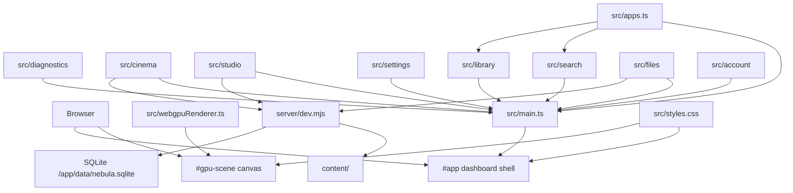

# Architecture

Nebula Dashboard is currently a small framework-free TypeScript app served by
Vite. It is intentionally simple while the shell concepts are still forming.

## Layers



## File Responsibilities

`src/main.ts`

- Builds the shell markup.
- Renders app tiles and detail panels.
- Handles keyboard and pointer input.
- Manages app-first dashboard navigation.
- Launches focused apps into the full-screen app surface.
- Starts the WebGPU renderer.

`src/apps.ts`

- Defines `DashboardApp`.
- Stores app metadata.
- Is the first place to add/remove dashboard apps.

`src/webgpuRenderer.ts`

- Requests WebGPU adapter/device.
- Creates the shader module and render pipeline.
- Draws a full-screen animated fragment shader every frame.
- Falls back to Canvas 2D when WebGPU is not available.

`src/diagnostics/`

- Collects renderer, display, runtime, performance, and app diagnostics.
- Keeps browser capability reads separate from shell rendering.

`src/cinema/`

- Renders and binds the Cinema video browser and web player.
- Talks to the backend through `src/api/cinemaApi.ts`.
- Generates browser-side preview thumbnails from local video files.
- Keeps optional TMDB rendering/controller logic and styles isolated in
  `tmdbUi.ts` and `tmdb.css`.

`src/studio/`

- Renders and binds the Studio music browser and native audio player.
- Talks to the backend through `src/api/musicApi.ts`.
- Keeps audio browsing and playback out of the Cinema surface.

`src/api/`

- Owns frontend API clients.
- Applies `VITE_API_BASE_URL` through `src/api/http.ts`, so the frontend can
  later point at a separate API origin without rewriting app surfaces.
- Also supports a runtime Server URL saved in local storage for native/mobile
  client shells.
- Applies cookie credentials, account bearer sessions, CSRF headers, expiration
  handling, and legacy service-token fallback.

`src/account/`

- Renders the blocking first-run/sign-in stage before shell construction.
- Owns dashboard identity, Account Settings, member management, password
  rotation, session revocation, and sign out.

`src/shared/`

- Owns shared TypeScript API contracts used by frontend clients and app views.
- Cinema request/response shapes currently live in `src/shared/cinemaTypes.ts`.
- Music request/response shapes currently live in `src/shared/musicTypes.ts`.

`src/settings/`

- Renders the Settings/Diagnostics app surface.
- Keeps dense diagnostics markup out of `src/main.ts`.

`src/search/`

- Renders the shared Search UI for the Search app.
- Filters app registry entries by name.

`src/library/`

- Renders the installed-app Library grid.
- Keeps app-library markup reusable for future application library surfaces.

`src/files/`

- Renders and binds the local content file browser.
- Uses the shared API URL helper so file APIs can move to a separate server
  origin later.

`server/dev.mjs`

- Wraps Vite middleware.
- Bootstraps storage, API routes, optional auth guard, and Vite middleware.

`server/api.mjs`

- Dispatches `/api/*` requests to domain route modules.
- Owns shared API error handling.

`server/cinema.mjs`

- Owns Cinema video library scanning, metadata updates, visual identification,
  and range-enabled video streaming.

`server/cinemaTmdb.mjs`

- Owns optional TMDB status, search, explicit apply, refresh, and episode-aware
  persistence routes without expanding the core Cinema route module.

`server/music.mjs`

- Owns Studio music library scanning and range-enabled audio streaming.

`server/mediaLibrary.mjs`

- Provides shared local media scan and metadata helpers for Cinema and Studio.

`src/shared/catalogTypes.ts`, `src/shared/playbackTypes.ts`, and
`server/mediaContracts.mjs`

- Freeze the provider-neutral Wave 0 media identities and structural service
  boundaries used by parallel Catalog and Playback work.
- Keep stable item/source UUIDs canonical while current path-based Cinema and
  Studio responses remain available through additive compatibility fields.
- Define interfaces only. Catalog tables, playback persistence, probing, and
  background jobs remain separate implementation tracks.
- See `docs/media-contracts.md` for identity, compatibility, migration, and
  shared-file ownership rules.

`server/database.mjs`, `server/catalog/`, and `server/playback/`

- Share the existing `/app/data/nebula.sqlite` connection while keeping domain
  migrations centrally ordered and independently testable.
- Catalog indexes the shared content root into stable item/source UUIDs and
  exposes additive catalog APIs without replacing current path-based clients.
- Playback records idempotent per-user lifecycle events and exposes Continue
  Watching independently of Cinema UI integration.

`server/jobs/` and `server/probe/`

- Persist bounded background work with retries, cancellation, deduplication,
  startup recovery, and owner-managed operational APIs.
- Run FFprobe with fixed arguments, path containment, time/output limits, and
  catalog-backed format, stream, HDR, subtitle, and chapter persistence.
- Startup scan jobs fan out revision-keyed probe jobs without blocking Cinema.

`server/backup/` and `server/observability/`

- Export integrity-checked admin backups of the shared SQLite database plus
  catalog-referenced metadata cache files without copying `content/`.
- Keep restore explicitly offline and staged into alternate roots so live
  SQLite state is never overwritten through an online request.
- Expose public liveness and opaque readiness endpoints while protecting
  detailed readiness and Prometheus metrics behind owner/service admin auth.

`server/playback-planner/`, `server/remux/`, `server/transcode/`, and
`server/playback/delivery.mjs`

- Plan from catalog probe data and client capabilities without trusting a
  client-authored decision.
- Bind expiring delivery sessions to the creating account and route direct,
  MP4 remux, or software HLS output through path-safe asset boundaries.
- Treat generated output as disposable cache cleaned on cancel, expiry,
  restart, and shutdown; absolute paths never cross the HTTP boundary.

`server/playbackPolicy/`

- Persists unlimited-by-default global and per-user stream/bitrate limits.
- Reserves generated delivery slots synchronously at the trusted admission
  boundary and releases them idempotently across terminal lifecycle paths.
- Keeps active leases process-local so restart cannot resurrect stale counts.
- Does not redesign planner, remux, or transcode ownership; it supplies the
  admitted bitrate ceiling to the existing software HLS runner.

`server/files.mjs`

- Owns local file browsing, creation, upload, resumable upload, rename, and
  delete routes.

`server/http.mjs`

- Provides shared backend HTTP helpers for JSON responses and request body
  parsing.

`server/storage.mjs`

- Owns content-root path safety, MIME typing, and shared media-file helpers.

`server/auth.mjs`

- Resolves account cookies, account bearer sessions, media tickets, legacy
  service tokens, CSRF, and centralized route capabilities.

`server/accountStore.mjs` and `server/accounts.mjs`

- Use Node's built-in SQLite support for transactional schema versioning,
  scrypt credentials, throttled login, users, sessions, preferences, personal
  Cinema watchlists, and path-bound media tickets.
- Store runtime identity data in `/app/data`, mounted from a Compose volume.

`capacitor.config.json`

- Defines the future iOS/native client shell identity for Capacitor.
- Keeps mobile packaging separate from the Docker-first server workflow.

`src/styles.css`

- Defines the visual language and responsive layout.
- Keeps the app console-like: full-screen, dense, controller-friendly, and not
  shaped like a marketing page.

## Shell State

The current state is deliberately small:

```ts
let focusedIndex = 0;
let launchedApp: DashboardApp | null = null;
let activeApp: DashboardApp | null = null;
```

The shell is constructed only after auth status and current-account restoration
complete. Setup/sign-in is a separate surface, so protected apps never flash
before authentication resolves.

`focusedIndex` controls the featured app and focused tile.

Selection follows the app-first interaction model:

- Hovering or clicking an app tile selects it.
- Arrow keys move selection without wrapping past the first or last app.
- Wheel/trackpad scrolling over the Applications strip advances selection one
  app at a time after a gated threshold.
- Click-dragging the Applications strip pans the row without launching apps.

`launchedApp` controls app detail panel visibility and content.

`activeApp` controls the full-screen app surface opened by the primary Open
command.

## Rendering Pattern

This app uses explicit render functions instead of a framework:

- `renderGrid()`
- `renderFocus()`
- `renderPanel()`
- feature renderers under `src/cinema/`, `src/studio/`, `src/settings/`,
  `src/search/`, `src/library/`, and `src/files/`

Keep render functions deterministic. If a render function inserts DOM, prefer
setting/replacing the relevant content instead of appending to existing content.
This prevents duplicate icons, stale controls, and repeated event binding.

## Extension Points

Add new apps in `src/apps.ts`.

Prefer app-first navigation. If a feature needs a persistent global navigation
surface later, document why it should sit outside the Applications strip and
update the manual browser checks with the new behavior.

Add renderer-driven UI effects in `src/webgpuRenderer.ts`. The shader already
receives `focus` as a uniform, populated from `document.documentElement.dataset`.
That can be used to make background motion react to app focus.

## Boundaries

Avoid pushing application logic into the shader renderer. The renderer should
know enough to draw a background, not own shell state.

Avoid making `src/main.ts` much larger without introducing modules. Good next
splits are:

- `src/shellState.ts`
- `src/renderers/panels.ts`
- `src/renderers/grid.ts`
- `src/appSurface.ts`
- `src/input.ts`
- `server/filesApi.mjs`
