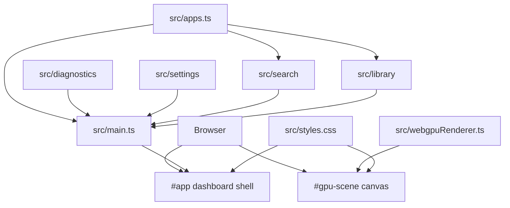

# Architecture

Nebula Dashboard is currently a small framework-free TypeScript app served by
Vite. It is intentionally simple while the shell concepts are still forming.

## Layers



## File Responsibilities

`src/main.ts`

- Builds the shell markup.
- Renders app tiles and detail panels.
- Handles keyboard and pointer input.
- Manages rail navigation state.
- Launches focused apps into the full-screen app surface.
- Starts the WebGPU renderer.

`src/apps.ts`

- Defines `DashboardApp`.
- Stores app metadata.
- Is the first place to add/remove dashboard apps.

`src/webgpuRenderer.ts`

- Requests WebGPU adapter/device.
- Creates the shader module and render pipeline.
- Draws a full-screen animated fragment shader every frame.
- Falls back to Canvas 2D when WebGPU is not available.

`src/diagnostics/`

- Collects renderer, display, runtime, performance, and app diagnostics.
- Keeps browser capability reads separate from shell rendering.

`src/settings/`

- Renders the Settings/Diagnostics system panel.
- Keeps dense diagnostics markup out of `src/main.ts`.

`src/search/`

- Renders the shared Search UI for the sidebar Search panel and full Search app.
- Filters app registry entries by name.

`src/library/`

- Renders the installed-app Library grid.
- Keeps app-library markup separate from rail routing.

`src/styles.css`

- Defines the visual language and responsive layout.
- Keeps the app console-like: full-screen, dense, controller-friendly, and not
  shaped like a marketing page.

## Shell State

The current state is deliberately small:

```ts
let focusedIndex = 0;
let launchedApp: DashboardApp | null = null;
let activeApp: DashboardApp | null = null;
let activeRail = "home";
```

`focusedIndex` controls the featured app and focused tile.

`launchedApp` controls app detail panel visibility and content.

`activeRail` controls which system rail item is active and which shell panel is
open.

`activeApp` controls the full-screen app surface opened by the primary Open
command.

## Rendering Pattern

This app uses explicit render functions instead of a framework:

- `renderRailIcons()`
- `renderGrid()`
- `renderFocus()`
- `renderPanel()`
- `renderRailState()`
- feature renderers under `src/settings/`, `src/search/`, and `src/library/`

Keep render functions deterministic. If a render function inserts DOM, prefer
setting/replacing the relevant content instead of appending to existing content.
This prevents duplicate icons, stale controls, and repeated event binding.

## Extension Points

Add new apps in `src/apps.ts`.

Add new rail sections in `src/main.ts`:

1. Add a rail button in the root shell markup.
2. Add corresponding content in `openShellPanel()`.
3. Update tests/manual verification for the new section.

Add renderer-driven UI effects in `src/webgpuRenderer.ts`. The shader already
receives `focus` as a uniform, populated from `document.documentElement.dataset`.
That can be used to make background motion react to app focus.

## Boundaries

Avoid pushing application logic into the shader renderer. The renderer should
know enough to draw a background, not own shell state.

Avoid making `src/main.ts` much larger without introducing modules. Good next
splits are:

- `src/shellState.ts`
- `src/renderers/panels.ts`
- `src/renderers/grid.ts`
- `src/appSurface.ts`
- `src/input.ts`
