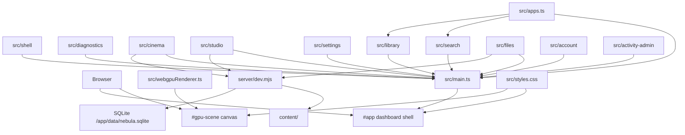

# Architecture

Nebula Dashboard is currently a small framework-free TypeScript app served by
Vite. It is intentionally simple while the shell concepts are still forming.

Both Compose stacks include a pinned official Tailscale userspace companion. Its
supervisor is dormant until an owner creates one fixed enable marker through
Settings. The unprivileged dashboard owns the shared network namespace and
loopback port; the companion joins that namespace so
fixed private Serve HTTPS can proxy to `127.0.0.1:5173`. The containers do not
share daemon sockets, state, privileges, host networking, or application
authorization. Disabling stops `tailscaled` without deleting node state or
interrupting localhost.
For browser-assisted enrollment, the companion publishes only a validated login
URL, connected marker, and exact `*.ts.net` hostname through a dedicated volume.
The dashboard can write or remove only the fixed enable marker; it receives no
daemon or Docker socket and cannot alter Serve or Funnel configuration. Nebula
validates the sidecar-published hostname exactly before passing requests to
Vite; arbitrary hosts and wildcard Tailscale suffixes remain rejected.
The companion also publishes a bounded atomic `tailscale status --json`
snapshot. The owner-only backend reduces it to device name, OS, online/activity
state, direct/peer-relay/DERP/idle classification, relay region, byte counters,
and snapshot time. Raw endpoint addresses, node keys, user identities, profile
data, and tailnet metadata never leave the backend API.

`server/transcode/` includes a provider-neutral acceleration model beside the
HLS runner. Detection is bounded, cached, optional, and fail-open to software;
selection remains downstream of playback planning and policy admission.

`server/renditions/` owns versioned, server-authored quality profiles and the
catalog-linked persistence contract for reusable interactive or scheduled
outputs. See `docs/renditions.md`.

`server/renditionPolicy/` owns the singleton storage policy, durable cleanup
scheduling, quota/minimum-free enforcement, safe LRU eviction, and aggregate
storage status. It never accepts caller-selected filesystem paths or eviction
candidates.

## Layers



## File Responsibilities

`src/main.ts`

- Builds the shell markup.
- Renders app tiles and detail panels.
- Dispatches shell commands from DOM events and binds app-specific surfaces.
- Launches focused apps into the full-screen app surface.
- Starts the WebGPU renderer.

`src/shell/`

- Owns typed shell state transitions and stable-ID focus selection.
- Validates and scopes safe focus persistence to the current account or guest.
- Defines shared keyboard, wheel, pointer, and gamepad command contracts.
- Owns wheel/repeat gates, standard gamepad mapping, and leak-free polling.

`src/apps.ts`

- Defines `DashboardApp`.
- Stores app metadata.
- Is the first place to add/remove dashboard apps.

`src/webgpuRenderer.ts`

- Requests WebGPU adapter/device.
- Creates the shader module and render pipeline.
- Draws a full-screen animated fragment shader every frame.
- Falls back to Canvas 2D when WebGPU is not available.

`src/diagnostics/`

- Collects renderer, display, runtime, performance, and app diagnostics.
- Keeps browser capability reads separate from shell rendering.

`src/cinema/`

- Renders and binds the Cinema video browser and web player.
- Talks to the backend through `src/api/cinemaApi.ts`.
- Generates browser-side preview thumbnails from local video files.
- Keeps optional TMDB rendering/controller logic and styles isolated in
  `tmdbUi.ts` and `tmdb.css`.

`src/studio/`

- Renders and binds the Studio music browser and native audio player.
- Talks to the backend through `src/api/musicApi.ts`.
- Keeps audio browsing and playback out of the Cinema surface.

`src/api/`

- Owns frontend API clients.
- Applies `VITE_API_BASE_URL` through `src/api/http.ts`, so the frontend can
  later point at a separate API origin without rewriting app surfaces.
- Also supports a runtime Server URL saved in local storage for native/mobile
  client shells; iOS account bearer sessions are stored only through the native
  Keychain bridge.
- Applies cookie credentials, account bearer sessions, CSRF headers, expiration
  handling, and legacy service-token fallback.

`src/account/`

- Renders the blocking first-run/sign-in stage before shell construction.
- Owns dashboard identity, Account Settings, member management, password
  rotation, session revocation, sign out, and responsive owner library-access
  administration.

`src/shared/`

- Owns shared TypeScript API contracts used by frontend clients and app views.
- Cinema request/response shapes currently live in `src/shared/cinemaTypes.ts`.
- Music request/response shapes currently live in `src/shared/musicTypes.ts`.

`src/settings/`

- Renders the Settings/Diagnostics app surface.
- Keeps dense diagnostics markup out of `src/main.ts`.

`src/activity-admin/`

- Renders and binds the owner-only, filterable Activity history in Settings.
- Uses `src/api/auditApi.ts` for bounded cursor pagination.

`server/audit/`

- Owns the `audit-v1` migration, strict event/redaction contract, retention,
  cursor queries, and owner/service-admin route.
- Records account, authorization, scan/job, backup, and server-administration
  seams best-effort so audit storage cannot corrupt primary operations.
- See `docs/audit-history.md`.

`src/search/`

- Renders the shared Search UI for the Search app.
- Filters app registry entries by name.

`src/library/`

- Renders the installed-app Library grid.
- Keeps app-library markup reusable for future application library surfaces.

`src/files/`

- Renders and binds the local content file browser.
- Uses the shared API URL helper so file APIs can move to a separate server
  origin later.

`server/dev.mjs`

- Wraps Vite middleware.
- Bootstraps storage, API routes, optional auth guard, and Vite middleware.

`server/api.mjs`

- Dispatches `/api/*` requests to domain route modules.
- Owns shared API error handling.

`server/cinema.mjs`

- Owns Cinema video library scanning, metadata updates, visual identification,
  and range-enabled video streaming.

`server/cinemaTmdb.mjs`

- Owns optional TMDB status, search, explicit apply, refresh, and episode-aware
  persistence routes without expanding the core Cinema route module.

`server/music.mjs`

- Owns Studio music library scanning and range-enabled audio streaming.

`server/mediaLibrary.mjs`

- Provides shared local media scan and metadata helpers for Cinema and Studio.

`src/shared/catalogTypes.ts`, `src/shared/playbackTypes.ts`, and
`server/mediaContracts.mjs`

- Freeze the provider-neutral Wave 0 media identities and structural service
  boundaries used by parallel Catalog and Playback work.
- Keep stable item/source UUIDs canonical while current path-based Cinema and
  Studio responses remain available through additive compatibility fields.
- Define interfaces only. Catalog tables, playback persistence, probing, and
  background jobs remain separate implementation tracks.
- See `docs/media-contracts.md` for identity, compatibility, migration, and
  shared-file ownership rules.

`server/database.mjs`, `server/catalog/`, and `server/playback/`

- Share the existing `/app/data/nebula.sqlite` connection while keeping domain
  migrations centrally ordered and independently testable.
- Catalog indexes the shared content root into stable item/source UUIDs and
  exposes additive catalog APIs without replacing current path-based clients.
- Catalog source revisions advance when observed size or modification time
  changes across same-path updates, safe renames, and restores; same-path
  replacements retain their separate new-source identity behavior.
- Playback records idempotent per-user lifecycle events and exposes Continue
  Watching independently of Cinema UI integration.

`server/permissions/`

- Owns the provider-neutral per-member media access policy and library grants.
- Defaults absent policies to all libraries so upgrades and new members retain
  the previous behavior; selected policies fail closed for future libraries.
- Enforces current grants at catalog, compatibility, media-ticket/path,
  playback-state, planner, and delivery-session boundaries. Owners and service
  administration retain all media access, while Files capabilities are
  unchanged.

`server/jobs/` and `server/probe/`

- Persist bounded background work with retries, cancellation, deduplication,
  startup recovery, and owner-managed operational APIs.
- Run FFprobe with fixed arguments, path containment, time/output limits, and
  catalog-backed format, stream, HDR, subtitle, and chapter persistence.
- Persist the source revision described by each probe and reject stale in-flight
  results if catalog reconciliation advances that revision before persistence.
- Startup scan jobs fan out revision-keyed probe jobs without blocking Cinema.

`server/backup/` and `server/observability/`

- Export integrity-checked admin backups of the shared SQLite database plus
  catalog-referenced metadata cache files without copying `content/`.
- Keep restore explicitly offline and staged into alternate roots so live
  SQLite state is never overwritten through an online request.
- Expose public liveness and opaque readiness endpoints while protecting
  detailed readiness and Prometheus metrics behind owner/service admin auth.

`server/playback-planner/`, `server/remux/`, `server/transcode/`, and
`server/playback/delivery.mjs`

- Plan from catalog probe data and client capabilities without trusting a
  client-authored decision.
- Bind expiring delivery sessions to the creating account and route direct,
  MP4 remux, or software HLS output through path-safe asset boundaries.
- Publish progressive HLS only after its first playlist-referenced segment is
  atomic, while keeping FFmpeg completion and concurrency accounting separate.
- Treat generated output as disposable cache cleaned on cancel, expiry,
  restart, and shutdown; absolute paths never cross the HTTP boundary.

`server/cluster/`

- Keeps coordinator scheduling, federation, paired-node trust, signed grants,
  and fixed server-to-server delivery routes separate from local media APIs.
- A shard replans generated delivery from signed catalog IDs, source revision,
  client capabilities, and a server-owned profile. It never receives the
  coordinator account database or caller-selected paths and returns only a
  bounded decision, status, and opaque delivery ID.
- Delivery-bound grants expose original/remux files or ticketed HLS assets
  directly from the selected shard. Playlist rewriting accepts only one-level
  shard-owned relative assets and rejects external or traversing references.
- Coordinator playback persistence stores federated item/source identities;
  shard-local catalog IDs, endpoints, filesystem paths, grants, and tickets do
  not enter account history.
- `cluster_node_controls` persists bounded coordinator policy separately from
  signed node descriptors. Display aliases cannot mutate trust identity;
  maintenance drain and capacity affect only new scheduler admission, while
  exact-replica filtering remains mandatory before failover ranking.

`server/renditions/`

- Defines trusted 240p, 360p, 480p, 720p, and 1080p H.264/AAC HLS profiles.
- Persists rendition identity by catalog source revision and profile version so
  changed originals cannot reuse stale generated output.
- Keeps storage identifiers server-internal and leaves FFmpeg execution,
  delivery authorization, and background scheduling to their existing domains.

`server/playbackPolicy/`

- Persists unlimited-by-default global and per-user stream/bitrate limits.
- Reserves generated delivery slots synchronously at the trusted admission
  boundary and releases them idempotently across terminal lifecycle paths.
- Keeps active leases process-local so restart cannot resurrect stale counts.
- Does not redesign planner, remux, or transcode ownership; it supplies the
  admitted bitrate ceiling to the existing software HLS runner.

`server/mediaLists/`

- Persists per-account ordered playlists and owner-managed shared collections
  using Catalog item UUIDs only.
- Filters every collection projection through current library permissions and
  retains missing-source entries as unavailable without exposing paths.
- See `docs/playlists-collections.md` for ordering, deletion, and API rules.

`server/files.mjs`

- Owns local file browsing, creation, upload, resumable upload, rename, and
  delete routes.

`server/http.mjs`

- Provides shared backend HTTP helpers for JSON responses and request body
  parsing.

`server/storage.mjs`

- Owns content-root path safety, MIME typing, and shared media-file helpers.

`server/auth.mjs`

- Resolves account cookies, account bearer sessions, media tickets, legacy
  service tokens, CSRF, and centralized route capabilities.

`server/accountStore.mjs` and `server/accounts.mjs`

- Use Node's built-in SQLite support for transactional schema versioning,
  scrypt credentials, throttled login, users, sessions, preferences, personal
  Cinema watchlists, and path-bound media tickets.
- Store runtime identity data in `/app/data`, mounted from a Compose volume.

`capacitor.config.json`

- Defines the future iOS/native client shell identity for Capacitor.
- Keeps mobile packaging separate from the Docker-first server workflow.

`src/styles.css`

- Defines the visual language and responsive layout.
- Keeps the app console-like: full-screen, dense, controller-friendly, and not
  shaped like a marketing page.

## Shell State

The current state remains deliberately small and is owned by
`src/shell/state.ts`:

```ts
interface ShellState {
  focusedAppId: string;
  detailAppId: string | null;
  activeAppId: string | null;
}
```

The shell is constructed only after auth status and current-account restoration
complete. Setup/sign-in is a separate surface, so protected apps never flash
before authentication resolves.

`focusedAppId` controls the featured app and roving-tabindex tile. Only this
safe preference is persisted, with a schema version and principal ID. Restore
is ignored when the app no longer exists or the signed-in principal changes.
Detail/app surfaces and authenticated UI state are never persisted.

Selection follows the app-first interaction model:

- Hovering or clicking an app tile selects it.
- Arrow keys move selection without wrapping past the first or last app.
- A connected standard gamepad uses either stick/D-pad for selection, A for
  Open, and B for Back, with delayed repeat for held navigation.
- Wheel/trackpad scrolling over the Applications strip advances selection one
  app at a time after a gated threshold.
- Click-dragging the Applications strip pans the row without launching apps.

`detailAppId` controls app detail panel visibility and content.

`activeAppId` controls the full-screen app surface opened by the primary Open
command.

## Rendering Pattern

This app uses explicit render functions instead of a framework:

- `renderGrid()`
- `renderFocus()`
- `renderPanel()`
- feature renderers under `src/cinema/`, `src/studio/`, `src/settings/`,
  `src/search/`, `src/library/`, and `src/files/`

Keep render functions deterministic. If a render function inserts DOM, prefer
setting/replacing the relevant content instead of appending to existing content.
This prevents duplicate icons, stale controls, and repeated event binding.

## Extension Points

Add new apps in `src/apps.ts`.

Prefer app-first navigation. If a feature needs a persistent global navigation
surface later, document why it should sit outside the Applications strip and
update the manual browser checks with the new behavior.

Add renderer-driven UI effects in `src/webgpuRenderer.ts`. The shader already
receives `focus` as a uniform, populated from `document.documentElement.dataset`.
That can be used to make background motion react to app focus.

## Boundaries

First-run guest access is isolated in `server/guest/`. Its sessions and media
tickets are memory-only, while account schema v3 owns the irreversible
`server_state.owner_initialized` marker. Shared integration hooks are limited to
`server/dev.mjs`, `server/auth.mjs`, `server/accounts.mjs`, and the Cinema/Music
ticket issuers. Those auth/account initialization files are the most likely
merge conflicts with parallel session-storage work; preserve the guest
principal and marker transaction when resolving them.

Avoid pushing application logic into the shader renderer. The renderer should
know enough to draw a background, not own shell state.

Avoid making `src/main.ts` much larger. State, persistence, and shared input now
live under `src/shell/`; good next splits are:

- `src/renderers/panels.ts`
- `src/renderers/grid.ts`
- `src/appSurface.ts`
- `server/filesApi.mjs`
