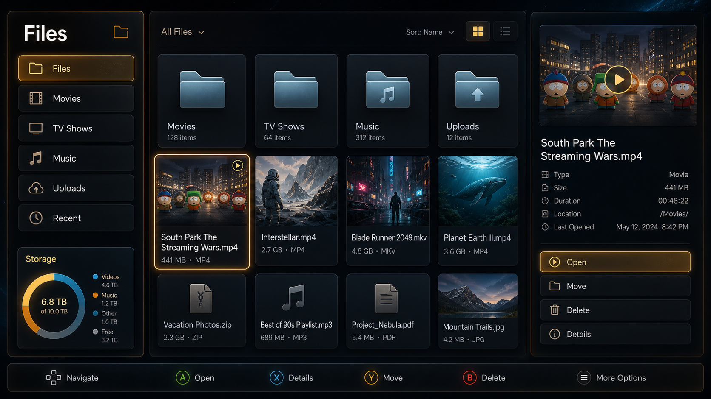

# Nebula Files Design Direction

This direction is based on the Variant 2 Files concept:

## Philosophy

Files should feel like a console-native content cockpit, not a desktop file
explorer squeezed into a browser. The user should be able to sit back, move with
a controller or keyboard, understand storage pressure at a glance, and act on
media without parsing dense tables.

The design has three persistent zones:

1. A left command column for location and system context.
2. A central file area for browsing real content.
3. A right summary pane for the selected item.

The interface should prioritize fast recognition over raw information density.
Folders and files are large, visual, and tactile. Metadata appears when it helps
the next action, not as a spreadsheet of every possible property.

## Layout Model

The left column carries two jobs:

- Section navigation: Files, Movies, TV Shows, Music, Uploads, Recent.
- Storage awareness: total usage, free space, and broad category breakdowns.

The center is the working area. It should show large cards for folders and files,
with the focused item receiving a strong controller-style ring. The current app
already supports drag/drop uploads and local file browsing; this design should
make those capabilities feel more like a living-room media library.

The right pane answers: "What am I looking at, and what can I do with it?" It
should show a preview when available, a short metadata stack, and a small set of
primary actions such as Open, Move, Delete, and Details.

## Visual Language

- Use deep graphite and storm-blue surfaces as the base.
- Use warm amber for focus, selected states, and primary actions.
- Use cyan sparingly for status accents and secondary telemetry.
- Prefer frosted panels, bevels, soft inner shadows, and luminous dividers.
- Keep text large enough for couch distance; avoid dense table rows.
- Preserve the existing Nebula atmosphere and WebGPU/canvas background.

## Interaction Principles

- Every interactive element should have an obvious focused state.
- Arrow-key/controller navigation should move predictably through sections,
  cards, summary actions, and the bottom command bar.
- Enter should open the focused file or primary action.
- Escape should back out one level before leaving the Files app.
- Drag/drop upload should remain available, but controller-first browsing should
  not depend on drag/drop.
- Destructive actions should require confirmation.

## Implementation Notes

Treat this as an evolution of the existing Files app, not a replacement of the
local API. Preserve the current upload, progress, cancel, resumable chunk, and
content-browsing behavior while reorganizing the UI around the three-zone model.

Keep the design framework-free unless a larger migration is explicitly approved.
The current app uses TypeScript render functions, template strings, and event
listeners; follow that pattern for this pass.

