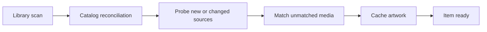

# Media Platform Parallel Implementation Plan

## Purpose

This plan coordinates the next phase of Nebula's media-server work across
multiple agents. The first TMDB implementation has merged and remains a
compatibility adapter until catalog-backed persistence lands.

Nebula should retain its console-first shell, Files app, WebGPU presentation,
Arcade direction, and local-first account model. The goal is to add the media
server foundations that currently separate it from mature systems such as
Jellyfin, without turning the product into a Jellyfin UI clone.

The first major milestone is to move Nebula from a dashboard that directly
plays local files to a durable media platform with:

- Stable media identities and an indexed catalog.
- Persistent per-user playback state.
- Technical media probing.
- Automatic metadata and artwork enrichment.
- Observable background processing.
- A foundation for remuxing and transcoding.

## Current Assumptions

- The TMDB provider implementation is merged; future persistence changes must
  follow the provider-neutral Catalog contract.
- The main agent owns integration decisions, shared contracts, merge order, and
  final verification.
- Each implementation agent works in a separate Git worktree and branch.
- All development and verification remain Docker Compose first.
- No agent installs project dependencies or applications on the host.
- Existing media in `content/` remains ignored and must not be moved or
  committed.
- Existing Cinema, Studio, Files, account, and media-ticket behavior must remain
  functional during migration.

## Coordination Principles

1. Parallelize by backend domain, not by UI component.
2. Merge shared contracts before implementations that consume them.
3. Use stable database IDs as canonical media identities; paths are mutable
   source attributes.
4. Keep descriptive metadata separate from technical stream metadata.
5. Keep shared media state separate from per-user playback state.
6. Make scans, probes, metadata refreshes, and playback updates idempotent.
7. Preserve compatibility APIs until the new catalog-backed paths are verified.
8. Do not make library scans synchronously wait for TMDB or artwork downloads.
9. Keep expensive media work observable, bounded, cancellable where practical,
   and recoverable after interruption.
10. Assign one owner to shared routing and migration files during each wave.

## Target Domain Model

The contract phase should define the following concepts before broad
implementation begins:

- `Library` - a configured, typed logical media library.
- `LibraryRoot` - one content path contributing files to a library.
- `MediaItem` - a stable logical movie, show, season, episode, artist, album, or
  track identity.
- `MediaSource` - a concrete local file or future remote source for an item.
- `MediaStream` - a video, audio, subtitle, attachment, or data stream discovered
  during probing.
- `MediaChapter` - a real embedded or generated chapter marker.
- `ExternalMetadata` - provider-neutral descriptive metadata and provider IDs.
- `Artwork` - cached poster, backdrop, logo, thumbnail, or album art.
- `PlaybackState` - per-user position, watched state, play count, and timestamps.
- `PlaybackSession` - an active device/client playback lifecycle.
- `BackgroundJob` - queued work with state, progress, retries, and errors.

Recommended module boundaries:

```text
server/catalog/
server/probe/
server/metadata/
server/jobs/
server/playback/
src/shared/catalogTypes.ts
src/shared/playbackTypes.ts
```

Provider identifiers should use a generic mapping instead of TMDB-specific
columns on the main media table:

```text
media_external_ids
  media_item_id
  provider
  provider_item_id
```

## Agent Tracks

| Track | Ownership | Primary deliverable | Important boundary |
| --- | --- | --- | --- |
| TMDB metadata | Metadata acquisition | Search, matching, provider IDs, normalized metadata, and artwork | Must not own scanning, playback, or the catalog schema |
| Catalog | Durable media catalog | SQLite schema, stable IDs, libraries, sources, and incremental scans | Must remain provider-neutral |
| Playback state | User media state | Progress, resume, watched state, history, and Continue Watching | Must remain separate from shared metadata |
| Probe | Technical media metadata | FFprobe execution, streams, duration, codecs, HDR, and chapters | Writes through catalog interfaces |
| Jobs and operations | Background orchestration | Persistent jobs, progress, retries, cancellation, and pipeline scheduling | Starts after catalog contracts stabilize |
| Cinema integration | Client and API integration | Item-ID APIs, Continue Watching, real chapters, and scan state | Starts after backend response contracts stabilize |
| QA and integration | Cross-track validation | Migrations, compatibility, fixtures, integration tests, and merge review | Main agent or dedicated integration agent |

With four agent slots, prefer three implementation agents plus the main
integration agent. Avoid filling all slots with feature work and leaving nobody
responsible for contract and merge integrity.

## Wave 0: Contract Freeze

The main agent should complete and merge a small contract change before broad
parallel work.

### Deliverables

- Shared catalog and playback types.
- Stable ID and path semantics.
- Repository/service interfaces for catalog consumers.
- Provider-neutral metadata interfaces.
- Compatibility expectations for current Cinema and Studio responses.
- API versioning or additive response rules.
- Ownership map for shared files.

### Required decisions

- Stable UUIDs are public media IDs.
- Content-relative paths remain server-controlled source attributes.
- TMDB IDs are external mappings, not primary keys.
- Manual metadata overrides can be locked against provider refreshes.
- A media item can become browseable before probing or metadata enrichment
  finishes.
- Renames should preserve identity when safely detectable.
- Missing files should become unavailable before eventual cleanup instead of
  disappearing immediately.

### Exit criteria

- All active agents agree on the interfaces they will consume.
- The contract commit is merged into `main`.
- Each worktree rebases onto that contract before implementation continues.

## Wave 1: Parallel Foundations

Run the following tracks concurrently.

### Track A: TMDB Metadata

The existing TMDB agent owns:

- Movie and TV search.
- Candidate matching.
- Provider identifiers.
- Metadata normalization.
- Poster and backdrop acquisition.
- Timeout, rate-limit, retry, and provider-error behavior.
- Manual identification and refresh semantics.

Expose a provider-neutral boundary similar to:

```ts
searchMetadata(query)
getMetadata(providerId, mediaKind)
getArtwork(providerId)
```

The TMDB agent must not own:

- Filesystem scanning.
- FFprobe integration.
- Playback state.
- General catalog migrations beyond an agreed provider mapping.
- A broad Cinema UI redesign.

If the current implementation writes `.cinema-metadata.json`, retain that only
as a temporary adapter. Redirect persistence into the catalog after the Catalog
track lands.

### Track B: Durable Catalog

Own:

- SQLite migrations for libraries, roots, items, sources, external IDs,
  artwork references, and scan state.
- Stable media IDs.
- Full and incremental scanning.
- New, changed, moved, missing, and restored file reconciliation.
- Repository and service interfaces used by metadata, probe, and playback code.
- Backward import from `.cinema-metadata.json`.
- Compatibility projection into current Cinema response shapes.

The first version should support the existing shared `content/` root while
making multiple typed roots possible later.

### Track C: Playback State

Own:

- Playback start, progress, pause, stop, and completion APIs.
- Per-user resume position.
- Played and unplayed state.
- Play count and last-played time.
- Continue Watching queries.
- Progress update throttling and validation.
- Authorization and cross-user isolation tests.

During transition, this track may accept a current content path through a
compatibility resolver. Stable media IDs become canonical after the Catalog
track is merged.

### Main agent responsibilities during Wave 1

- Review interfaces and database boundaries.
- Prevent duplicate or conflicting migrations.
- Coordinate changes to shared routing.
- Add compatibility adapters where needed.
- Prepare migration and cross-track integration tests.
- Keep each branch rebased on accepted contract changes.

### Wave 1 exit criteria

- Current accounts and media-ticket tests still pass.
- A scan creates stable catalog records.
- A catalog item can hold provider-neutral external IDs.
- Playback progress persists per user.
- Continue Watching can be queried without requiring the new Cinema UI.
- TMDB failures do not prevent local items from being cataloged or played.

## Wave 2: Media Intelligence and Orchestration

Begin after the catalog schema and repository interface have merged.

### Track D: FFprobe Integration

Own:

- Containerized FFprobe availability.
- Argument-array subprocess execution without shell interpolation.
- Bounded output, timeouts, and concurrency.
- Corrupt, unsupported, missing, or partial-file handling.
- Container, duration, bitrate, and format extraction.
- Video dimensions, frame rate, bit depth, and HDR fields.
- Audio codec, channels, language, and layout.
- Subtitle codec, language, forced/default flags, and title.
- Embedded chapters.
- Fixture-driven unit and integration tests.

FFprobe must write through Catalog services rather than manipulating SQLite
directly. All paths must pass through existing content-root safety checks.

### Track E: Persistent Background Jobs

Own:

- Queued, running, succeeded, failed, and cancelled job states.
- Bounded worker concurrency.
- Retry policy and terminal failure recording.
- Progress and current-stage reporting.
- Manual job APIs.
- Startup recovery for interrupted work.
- Scan, probe, metadata, artwork, and cleanup orchestration.
- Maintenance hooks for future cache and database work.

Initial pipeline:



Scanning should enqueue enrichment work rather than blocking on it.

### Track F: Cinema Integration

Own:

- Stable-item-ID API usage.
- Continue Watching rail.
- Resume prompt and progress indicators.
- Watched/unwatched controls.
- Real embedded chapters instead of prototype static markers.
- Scan and enrichment status.
- Local fallback UI while metadata or artwork is pending.
- Playback lifecycle reporting.
- Backward-compatible behavior during rollout.

Keep the work inside Cinema and relevant shared API clients. Do not combine it
with a broad `src/main.ts` refactor.

### Wave 2 exit criteria

- New and changed files are cataloged, probed, and enriched asynchronously.
- Job state and failures are inspectable.
- Corrupt files do not crash or block a scan.
- Cinema uses stable IDs and real playback state.
- Continue Watching survives reload and works independently per user.
- Embedded chapters appear when present.
- TMDB downtime leaves a usable local fallback item.

## Wave 3: Playback Compatibility

Start only after catalog records contain trustworthy technical stream data.

Wave 2 is complete. The shared Wave 3 request/response contract is defined in
`src/shared/playbackPlanTypes.ts` and `docs/playback-planning.md`.

### Playback planner

Implement in this order:

1. Client capability declaration.
2. Playback decision response with an explicit reason.
3. Direct-play eligibility.
4. Container remux/direct stream.
5. Software transcoding.
6. HLS session lifecycle and cleanup.
7. Subtitle extraction, remuxing, and burn-in decisions.
8. Hardware acceleration after the software path is correct.

Suggested API direction:

```text
POST   /api/playback/plan
POST   /api/playback/sessions
GET    /api/playback/sessions/:id/master.m3u8
DELETE /api/playback/sessions/:id
```

Do not parallelize initial FFmpeg work and hardware acceleration. First make
software remuxing/transcoding correct, bounded, cancellable, observable, and
covered by tests.

### Wave 3 exit criteria

- The server can explain why an item direct plays or cannot direct play.
- At least one incompatible-container case can be remuxed.
- At least one incompatible-codec case can be software-transcoded.
- Transcode sessions clean up after completion, failure, cancellation, and
  server restart.
- Playback authorization remains path- and user-scoped.

## Wave 4: Operational Maturity

These tracks can proceed in parallel after the core media pipeline is stable:

- Backup and restore for the SQLite database and cached metadata.
- Health, readiness, and Prometheus-compatible metrics.
- Background-task administration UI.
- Structured activity and audit history.
- Per-library user permissions.
- Concurrent stream and bitrate policies.
- Keychain-backed iOS session storage.
- Playwright browser coverage.
- Persistent playlists and collections.
- Subtitle acquisition and per-user language preferences.
- Broader packaging and deployment documentation.

Live TV, DVR, DLNA, synchronized playback, casting, and a plugin ecosystem are
later product decisions. They should not delay catalog, playback state, probing,
metadata, jobs, or playback compatibility.

## Merge Order

Parallel development does not imply arbitrary merge order. Merge in this
sequence:

1. Shared domain contracts.
2. Catalog schema and repository.
3. Compatibility adapters for current Cinema and Studio APIs.
4. TMDB provider implementation.
5. Playback-state persistence.
6. FFprobe ingestion.
7. Background-job orchestration.
8. Cinema UI and API integration.
9. Playback planner and remuxing.
10. Software transcoding.
11. Operational tools and expanded permissions.

TMDB may merge before the Catalog only if it is isolated behind the agreed
provider-neutral interface. Otherwise, finish it on its branch, rebase it onto
the catalog work, and adapt its persistence before merging.

## File Ownership and Conflict Boundaries

Recommended ownership:

- TMDB agent: `server/metadata/**` and focused provider tests.
- Catalog agent: `server/catalog/**` and catalog migrations/tests.
- Playback-state agent: `server/playback/**` and playback-state tests.
- Probe agent: `server/probe/**` and probe fixtures/tests.
- Jobs agent: `server/jobs/**` and job tests.
- Cinema integration agent: `src/cinema/**` and relevant API clients.
- Main integration agent: shared routing, shared contracts, cross-domain
  migrations, compatibility adapters, and final documentation.

Only the main integration agent should edit these shared files during an active
wave unless ownership is explicitly handed off:

- `server/api.mjs`
- `server/dev.mjs`
- central database migration registration
- shared response contracts used by multiple tracks

Avoid simultaneous edits to `server/cinema.mjs`. Gradually reduce it to a thin
route adapter over domain services. Avoid large concurrent changes to
`src/main.ts`.

## Worktrees and Branches

Suggested branches:

```text
codex/media-contracts
codex/media-catalog
codex/playback-state
codex/tmdb-metadata
codex/media-probe
codex/background-jobs
codex/cinema-integration
codex/playback-planner
```

Every worktree must use a unique Compose project name and free host port. Do not
run side worktrees on the main dashboard port.

Example worktree environment:

```sh
export COMPOSE_PROJECT_NAME=nebula-$(basename "$PWD")
export DASHBOARD_PORT=$(python3 - <<'PY'
import socket
with socket.socket() as s:
    s.bind(("127.0.0.1", 0))
    print(s.getsockname()[1])
PY
)
docker compose up --build
```

Use the same environment for checks and shutdown.

## Required Verification

Each branch must pass:

```sh
docker compose run --rm dashboard npm run check
docker compose run --rm dashboard npm test
test ! -d node_modules && test ! -d dist && echo "host clean"
```

The integration branch must additionally test:

- A fresh database.
- Upgrade from the current account database schema.
- Import of existing `.cinema-metadata.json`.
- Existing personal watchlists.
- New, changed, renamed, missing, restored, and deleted media.
- Corrupt and partially uploaded media.
- TMDB unavailable, rate-limited, malformed, or slow.
- FFprobe unavailable, timed out, or returning malformed output.
- Interrupted scans and jobs followed by restart.
- Duplicate scans and retries without duplicate catalog rows.
- Cross-user playback-state isolation.
- Revoked sessions and media tickets.
- Existing Files owner/member authorization.
- Cinema and Studio byte-range behavior.
- Mobile/API CORS behavior.

## Immediate Assignment

With the initial TMDB implementation merged, use the available agent slots as follows:

1. **Catalog agent:** build stable IDs, schema, repository, scanning, and legacy
   metadata import.
2. **Playback-state agent:** build progress, watched state, history, and
   Continue Watching APIs.
3. **Main agent:** own contracts, TMDB adaptation, shared routing, compatibility, reviews,
   integration tests, and merge preparation.

After the Catalog track merges:

1. Move the Catalog agent to FFprobe ingestion.
2. Move the Playback-state agent to Cinema Continue Watching integration.
3. Start a background-jobs agent.
4. Keep the main agent focused on integration and complete Docker verification.

## Main Agent Handoff Checklist

Before starting implementation, the main agent should:

- Inspect the TMDB agent's current branch, changed files, persistence model, and
  expected API.
- Confirm which agent owns database migration registration.
- Write and merge Wave 0 contracts.
- Create isolated worktrees and branches.
- Send each agent its exact ownership boundary and exit criteria.
- Require agents to report schema/API changes before merging.
- Integrate one domain at a time in the documented merge order.
- Run the complete Docker check and test suite after every merge.
- Update `docs/architecture.md`, `docs/cinema.md`, `docs/testing.md`, and
  `docs/session-handoff.md` as capabilities become real.

The first product milestone is complete when Nebula can index media into stable
catalog records, enrich it asynchronously through TMDB, probe its real streams,
persist user playback progress, and present a working Continue Watching
experience without regressing current accounts, Files, Cinema, Studio, or
mobile access.
