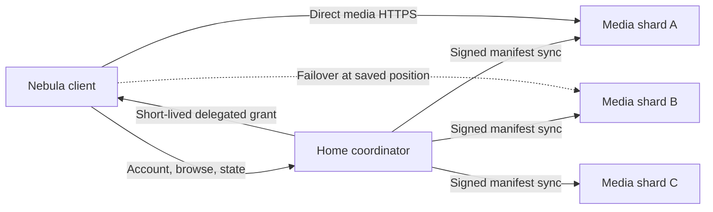

# Nebula Media Sharding Implementation Plan

## Status

This document scopes the next major media-platform feature. It is an
implementation handoff, not a statement that sharding is currently available.

The recommended first release uses one **coordinator** and one or more **media
shards**. A normal single-server Nebula installation remains supported and acts
as a one-node cluster.

## Product Goal

Allow a client to sign in to one Nebula coordinator and browse the combined
Cinema and Studio libraries of every paired Nebula shard on the same private
Tailscale network.

The combined experience must:

- show one logical library item when the same work exists on multiple shards;
- retain every distinct edition, encoding, and quality as an available source;
- identify which shards currently provide an item;
- show the shard selected for playback and the delivery mode;
- distribute different playback sessions across healthy replicas;
- fail over to another exact replica without losing the user's position;
- preserve Nebula accounts, roles, library permissions, playback history,
  watchlists, media tickets, CSRF protection, and audit history;
- continue to work as a standalone single-server installation.

Tailscale provides private reachability, HTTPS, stable tailnet names, and
tailnet policy enforcement. It does not provide catalog federation, Nebula
account federation, application authorization, or media load balancing. Those
remain Nebula responsibilities.

## Recommended Architecture



### Coordinator

The coordinator is the client's configured Nebula Server URL and the source of
truth for:

- users, sessions, roles, and library permissions;
- the federated catalog projection;
- watchlists, playlists, playback history, resume state, and watched state;
- shard trust, policy, health, and scheduling;
- owner-visible cluster administration and audit events.

The coordinator may also contain local media and act as a shard. This keeps the
current deployment model intact.

### Media shard

A shard owns its local files, local catalog, probes, artwork cache, renditions,
and transcode workers. It publishes a signed, path-free catalog manifest to the
coordinator and accepts only narrowly scoped cluster requests.

A shard does not receive the user's password, browser session cookie, CSRF
secret, account database, or unrestricted service token.

### Client

The client browses through the coordinator. Once a playback location is chosen,
the coordinator returns a short-lived delegated media grant and an exact shard
HTTPS URL. Media then flows directly from that shard to the client instead of
being proxied through the coordinator.

This keeps the coordinator out of the media data path while preserving one
account and one unified library experience.

## Why Not Peer-To-Peer Everything

Making every client discover and query every shard would spread trust,
deduplication, policy, and failure handling across browser and native clients.
It would also require portable account sessions or separate sign-in on every
server. A coordinator gives Nebula one authoritative policy boundary and lets
clients remain comparatively simple.

Redundant coordinators and multi-master account replication are separate future
projects. They are not required to gain distributed storage and playback
capacity.

## Cluster Enrollment And Trust

### Pairing flow

1. An owner enables shard mode on a Nebula server.
2. The shard creates an expiring one-time pairing code.
3. On the coordinator, the owner enters the shard's exact Tailscale Serve HTTPS
   URL and pairing code.
4. The two servers exchange cluster IDs, node IDs, public signing keys,
   capabilities, and certificate-bound endpoint information.
5. Each side pins the other's node identity and records an audited trust event.
6. The pairing code is consumed and can never become a long-lived credential.

Each server should generate an Ed25519 identity key in its persistent data
volume. Keys must never live in `content/`, `.env`, logs, URLs, browser storage,
or Git.

### Discovery

The first release uses explicit pairing with an exact `https://*.ts.net` URL.
Do not use Tailscale OAuth credentials, the Tailscale daemon socket, tailnet-wide
device enumeration, mDNS, or unauthenticated broadcast discovery.

Optional owner-approved discovery can be evaluated later. Manual pairing is
more predictable, easier to audit, and does not broaden the dashboard
container's Tailscale privileges.

### Server-to-server authentication

Cluster requests must be signed at the application layer even though Tailscale
encrypts and restricts the network path. A signed request should include:

- cluster ID and sending node ID;
- HTTP method and canonical route;
- body digest;
- timestamp, nonce, and protocol version;
- Ed25519 signature.

Receivers enforce a short clock window, persist or cache used nonces, reject
redirects, and reject revoked/rotated keys. Pairing, removal, key rotation,
drain-mode changes, and authorization failures are audited.

## Catalog Identity And Deduplication

Nebula's current item and source UUIDs are local to one SQLite catalog. They
must remain valid local IDs, but they cannot be used as cross-shard identity.

Federation needs three explicit identity layers.

### 1. Logical work identity

A logical work represents the title users see once in the unified library.
Prefer deterministic provider-backed keys:

- movie: provider + movie ID;
- show: provider + show ID;
- episode: provider + show ID + season/episode coordinates;
- music: MusicBrainz recording/release IDs when a future provider exists.

Different encodes of the same work can share a logical item without pretending
their bytes are identical.

When provider identity is absent, use a normalized candidate signature made
from media kind, title, year, and episode coordinates. This signature may
propose a match but must not silently merge ambiguous items. Ambiguous items
stay separate until an owner confirms a merge.

Support durable owner `merge` and `split` overrides so an incorrect automatic
decision can be repaired without rewriting local shard catalogs.

### 2. Edition identity

Different cuts, releases, language variants, or materially different versions
of the same work should be separate editions beneath one logical work. Edition
metadata may initially be sparse, but the data model must not collapse Director's
Cuts, theatrical releases, or distinct album releases into interchangeable
replicas.

### 3. Exact content identity

An exact replica is proven by a strong content digest, not by filename, title,
path, size, or modification time.

Add persisted source fingerprint state to the local catalog:

- algorithm and version;
- full-file SHA-256 or BLAKE3 digest;
- byte length;
- fingerprint status and timestamp;
- content revision used to produce the digest.

Hashing should run as a low-priority background job with bounded I/O. A quick
sample digest may prioritize likely matches, but only a completed strong digest
may authorize seamless replica failover or multi-origin delivery.

Different source hashes under the same logical work are alternate sources or
renditions, not replicas.

## Federated Catalog Projection

Keep each shard's current local catalog independent. Add a coordinator-owned
projection instead of copying shard rows directly into the coordinator's local
`media_items` and `media_sources` tables.

Suggested coordinator tables:

- `cluster_identity`
- `cluster_nodes`
- `cluster_node_keys`
- `cluster_manifest_cursors`
- `federated_items`
- `federated_editions`
- `federated_sources`
- `federated_replicas`
- `federated_dedupe_overrides`
- `cluster_delivery_assignments`

Every federated row records its contributing shard node, shard-local item/source
IDs, source revision, last-seen manifest revision, and availability. No content
path or host filesystem detail is exposed to clients.

### Manifest synchronization

Shards expose a versioned, cursor-based manifest containing:

- shard-local IDs and revisions;
- logical/provider identity candidates;
- exact fingerprint state and digest when ready;
- media kind, duration, edition metadata, probe summary, codecs, dimensions,
  bitrate, and available rendition profiles;
- artwork references that can be fetched with scoped grants;
- availability and deletion tombstones;
- shard capabilities and schema/protocol versions.

The coordinator polls with an exponential backoff and can request a full
reconciliation after cursor loss. Manifests are signed, bounded, paginated, and
validated before applying them transactionally.

An offline shard remains visible as temporarily unavailable. Its catalog is not
deleted after one missed heartbeat. Retention and final removal are explicit
owner policies.

## Playback Scheduling

### First-release behavior

Choose one shard for each playback session. Balance separate sessions across
shards and keep a session sticky to its chosen shard unless it fails.

Only shards that satisfy account library permissions and have a matching
available source are candidates. Rank candidates using:

1. exact compatible source or prebuilt rendition availability;
2. direct play before remux, and remux before new transcode;
3. owner priority, disabled/draining state, and per-node policy limits;
4. current stream count, transcode slots, CPU pressure, and job backlog;
5. recent health, readiness, and storage state;
6. client-observed latency and Tailscale Direct/peer-relay/DERP path;
7. recent failures and cooldown state.

Do not prefer a nominally less-loaded DERP path over a healthy direct shard
without considering measured throughput and startup latency.

The scheduler returns an explainable decision so Settings and diagnostics can
show why a shard was selected.

### Delegated media grants

The coordinator creates a short-lived signed grant scoped to:

- cluster, shard, account, and client device;
- federated item and exact shard source/rendition revision;
- allowed HTTP methods and asset prefix;
- requested quality and playback session;
- issue time, expiry, nonce, and optional byte/segment constraints.

The shard validates the coordinator signature and its own local authorization
projection before serving media. Grants must be revocable by node removal and
must not be reusable for arbitrary files or API routes.

Exact CORS origins must include the configured coordinator web origin and
supported native origins. Do not use wildcard credentialed CORS.

### Failover

If the selected shard becomes unavailable:

1. pause new fetches and retain the last acknowledged playback position;
2. ask the coordinator for another candidate with the same exact content or
   deterministic rendition identity;
3. issue a new grant;
4. resume at the saved position;
5. show a brief `Switched to <shard>` status and record the failure.

For HLS, failover may resume at a matching segment boundary. For direct files,
seek by media time after reopening the new source. Never claim seamless exact
failover when only a different edition or unmatched encode exists; prompt or
restart explicitly instead.

Playback events, resume state, watch history, and policy admission remain
coordinator-owned. Active playback may continue until its shard grant expires if
the coordinator briefly becomes unavailable, but browsing and new sessions
require the coordinator in the first release.

## Can One Playback Use Multiple Shards?

### Practical answer

Not safely with the current native `<video>` direct-file path. A browser media
element reads one URL, and byte ranges from different encodes cannot be mixed.
A coordinator proxy or a custom Media Source Extensions pipeline would have to
split, fetch, verify, reorder, and reassemble data. That adds a new bottleneck
and substantial correctness complexity.

The highest-value load sharing is therefore **session-level balancing**: ten
viewers can be distributed across three shards, while each viewer has one
stable source and a failover candidate.

### Later experimental multi-origin HLS

Multi-origin playback can be investigated only after Nebula has:

- byte-identical, content-addressed HLS renditions on multiple shards;
- the same manifest and segment boundaries on every participating shard;
- per-segment integrity hashes;
- short-lived grants accepted by all selected shards;
- measured Direct/DERP path quality;
- a controlled hls.js loader for compatible browsers and a validated strategy
  for native Safari/iOS HLS.

The experiment should race or prefetch from at most two replicas and use one
origin per segment. It should not blindly stripe arbitrary byte ranges. Disable
it automatically when renditions differ, a client uses unsupported native HLS,
or measured performance is worse than a single source.

This is a post-MVP optimization with an explicit feature flag and benchmark
gate, not a correctness requirement for sharding.

## User Experience

### Library

- Show one card per federated logical item.
- Add a subtle server-stack badge such as `3 shards` when multiple copies or
  sources are available.
- Avoid noisy badges for the ordinary one-shard case unless the user enables a
  diagnostics preference.
- Search and grouping operate on federated items, not per-shard duplicates.

### Detail and playback views

- Add an `Available on` section with shard name, online state, source quality,
  direct-play/transcode capability, and optional owner priority.
- Display `Streaming from Basement · Direct · 1080p` in the player status.
- Display `Also available on 2 shards` when failover candidates exist.
- Surface a nonblocking message when playback changes shards.
- Keep the shard chooser automatic by default, with an advanced manual override
  for owners and diagnostics.

### Settings / Cluster

Add an owner-only Cluster surface with:

- coordinator identity and standalone/cluster mode;
- pairing, rename, remove, trust reset, and key rotation;
- online, stale, offline, and draining states;
- last manifest sync and scan state;
- storage, rendition, transcode, and active-stream capabilities;
- client-to-shard path quality when available: Direct, peer relay, DERP, RTT,
  and recent throughput;
- scheduler priority, transcode limits, and maintenance drain controls;
- deduplication conflicts and manual merge/split review.

Cinema and Studio use the same shared availability components. Files remains a
local server-management app in the initial release; federated file management
is explicitly out of scope.

## API Sketch

Names are provisional and should be finalized in shared contracts before route
implementation.

Owner/client coordinator APIs:

```text
GET    /api/cluster/status
POST   /api/cluster/shards
PATCH  /api/cluster/shards/:nodeId
DELETE /api/cluster/shards/:nodeId
GET    /api/cluster/items
GET    /api/cluster/items/:federatedItemId
POST   /api/cluster/dedupe-overrides
POST   /api/cluster/playback-sessions
GET    /api/cluster/playback-sessions/:sessionId
```

Internal signed shard APIs:

```text
POST   /api/shard/v1/pair
GET    /api/shard/v1/manifest?cursor=<cursor>
GET    /api/shard/v1/health
POST   /api/shard/v1/playback/plan
POST   /api/shard/v1/playback/grants/validate
GET    /api/shard/v1/media/<scoped-asset>
```

Internal routes must not accept arbitrary paths, proxy targets, shell commands,
or caller-selected filesystem locations.

## Security Boundaries

- Tailscale access is an outer network boundary; Nebula authorization remains
  mandatory on every control and media request.
- Keep Funnel disabled. No public port or router forwarding is required.
- Do not share account SQLite databases, session secrets, password hashes,
  service API tokens, or CSRF secrets between nodes.
- Do not trust `X-Forwarded-Proto`, node names, source IPs, or MagicDNS names as
  authentication.
- Pin paired node keys and exact HTTPS endpoints. Reject redirects and protect
  all server-side fetches from SSRF and DNS rebinding.
- Apply library permissions before exposing federated metadata, artwork,
  availability, or playback grants.
- Redact filenames, content paths, hashes, grants, and node secrets from logs,
  audit details, metrics labels, and UI error messages.
- Rate-limit pairing, manifest, planning, and grant validation endpoints.
- Version and bound manifests; reject unknown fields that alter trust or path
  behavior.
- Node removal immediately blocks new grants and invalidates trust. Active
  grants receive a short bounded revocation window.
- Cluster data, keys, and cursors live in `/app/data` and follow the existing
  backup encryption and restore policy.

## Delivery Plan

### Implementation status (2026-07-19)

- Phase 0 is complete: protocol contracts, threat model, and rollout boundaries
  are committed.
- Phase 1 is complete: persistent Ed25519 node identity, one-time pairing,
  fixed-proxy Tailscale transport, replay defense, and revocation are available
  behind `NEBULA_CLUSTER_ENABLED`.
- Phase 2 backend is complete: revision-bound SHA-256 jobs, signed path-free
  manifests, bounded revision-pinned cursor pages, explicit missing-source
  tombstones, full reconciliation, conservative projection/deduplication,
  conflict diagnostics, and durable merge/split overrides are implemented.
- Phase 3 unified client browsing is next. Cinema and Studio still use their
  local compatibility APIs until that phase is browser-verified.

### Phase 0: contracts and threat model

- Define cluster roles, protocol versioning, node identity, signatures, and
  error contracts.
- Define federated item/source/grant shared TypeScript schemas.
- Decide migration ownership and backup/restore behavior.
- Add a focused threat model for pairing, SSRF, replay, grant theft, malicious
  manifests, confused-deputy authorization, and node revocation.
- Preserve standalone behavior behind a disabled-by-default cluster feature
  flag.

Exit: contracts and threat model are reviewed before persistent migrations or
routes land.

### Phase 1: node identity and pairing

- Add cluster identity/key storage and centrally ordered migrations.
- Add owner-only shard mode, pairing code, explicit coordinator pairing, key
  rotation, removal, and audit events.
- Add signed-request middleware and replay protection.
- Add fake-node integration tests; do not require real tailnet credentials.

Exit: two isolated Compose projects can pair, authenticate health requests, and
revoke trust without exposing media.

### Phase 2: fingerprints and manifests

- Persist source fingerprint state and background hash jobs.
- Add bounded incremental manifests, tombstones, cursors, and full reconcile.
- Add coordinator projection tables and conservative deduplication.
- Add manual merge/split overrides and conflict diagnostics.

Exit: duplicate fixtures on two shards appear once; alternate encodes and
ambiguous titles are not incorrectly collapsed.

### Phase 3: unified browsing

- Add federated Cinema and Studio query services.
- Add availability badges, detail-source lists, shard health, and responsive
  Cluster Settings.
- Preserve existing local API compatibility during migration.

Exit: desktop and 390x844 clients browse one deduplicated library while shards
are added, removed, stale, and offline.

### Phase 4: scheduled playback and failover

- Add scheduler inputs, explainable scoring, drain mode, and policy admission.
- Add delegated grants and direct client-to-shard delivery.
- Integrate direct play, remux, HLS transcode, subtitles, quality selection,
  persistent renditions, and playback state.
- Add sticky playback and exact-replica failover.

Exit: concurrent sessions distribute across shards, permissions remain
isolated, and killing the active shard resumes an exact replica near the same
position.

### Phase 5: operations and hardening

- Add readiness, bounded metrics, audit events, stale-manifest policy, cooldown,
  clock-skew diagnostics, key rotation, and backup/restore tests.
- Add owner priority and capacity controls.
- Add mixed-version compatibility and rolling-update tests.
- Run real-tailnet Direct and DERP-relayed playback tests.

Exit: a node can be drained, updated, restarted, restored, and removed without
catalog corruption or unauthorized playback.

### Phase 6: optional multi-origin HLS experiment

- Generate deterministic content-addressed renditions.
- Add per-segment integrity and replica maps.
- Prototype a bounded hls.js multi-origin loader.
- Measure startup, rebuffering, throughput, server load, and relay overhead
  against the single-best-shard scheduler.

Exit: ship only if it is measurably better and reliable across supported
clients. Otherwise retain session-level load balancing.

## Parallel Workstreams

After Phase 0 freezes contracts, the following can proceed in separate
worktrees:

1. Cluster identity, signed transport, pairing, and threat-model tests.
2. Fingerprint jobs, manifests, and local catalog migration.
3. Coordinator projection, deduplication, and conflict resolution.
4. Scheduler, delegated grants, policy integration, and failover.
5. Shared Cinema/Studio availability UI and Cluster Settings.
6. Multi-project Compose fixtures, Playwright coverage, chaos, and security
   tests.

One integration owner must exclusively coordinate shared migrations,
`server/api.mjs`, `server/dev.mjs`, shared contracts, and compatibility routes.
Do not start all workstreams against unfrozen schemas.

## Required Verification

Automated coverage must include:

- standalone single-node compatibility;
- pairing, replay rejection, key rotation, revocation, and owner-only controls;
- exact-host and SSRF rejection;
- manifest pagination, cursor loss, stale data, tombstones, and schema mismatch;
- exact duplicate, alternate encode, edition, episode, and ambiguous-title
  deduplication fixtures;
- per-user library permission isolation across all shards;
- direct, remux, HLS, subtitles, quality, and persistent rendition delivery;
- scheduler scoring, capacity, drain mode, cooldown, and deterministic fallback;
- exact-replica failover with resume tolerance;
- shard/coordinator restart, clock skew, network partition, and rolling update;
- desktop, 390x844, keyboard/controller, and native-client navigation;
- no secrets, paths, hashes, or grants in logs, HTML, metrics, or Git status.

Use separate Compose projects and generated fixtures for at least three nodes.
Do not use ignored personal media. Complete Docker checks and host-clean checks
for every worktree.

Real-tailnet verification should cover both Direct and DERP-relayed paths,
revoked tailnet access, an offline shard, and simultaneous streams. It must not
require or commit Tailscale credentials.

## MVP Non-Goals

- automatic tailnet-wide server discovery;
- public access or Tailscale Funnel;
- cross-tailnet federation;
- account/password/session database replication;
- redundant or multi-master coordinators;
- automatic media file replication;
- federated Files mutations;
- global metadata editing on every shard;
- arbitrary direct-file striping across servers;
- silent merging of uncertain identities or distinct editions.

## Recommended Product Decisions

Unless product requirements change, implementation should assume:

- one owner-managed coordinator is acceptable for the first release;
- all paired shards belong to the same trusted household/organization and
  tailnet, but are still mutually authenticated at the application layer;
- each client configures only the coordinator URL;
- the coordinator remains the canonical home for personal state;
- playback uses one shard at a time with exact-replica failover;
- multi-origin HLS remains an opt-in experiment;
- uncertain duplicates remain visible rather than risking data loss or playing
  the wrong edition.

These decisions deliver the unified-library and distributed-capacity benefits
without first solving distributed account databases or inventing a fragile
multi-source media transport.
