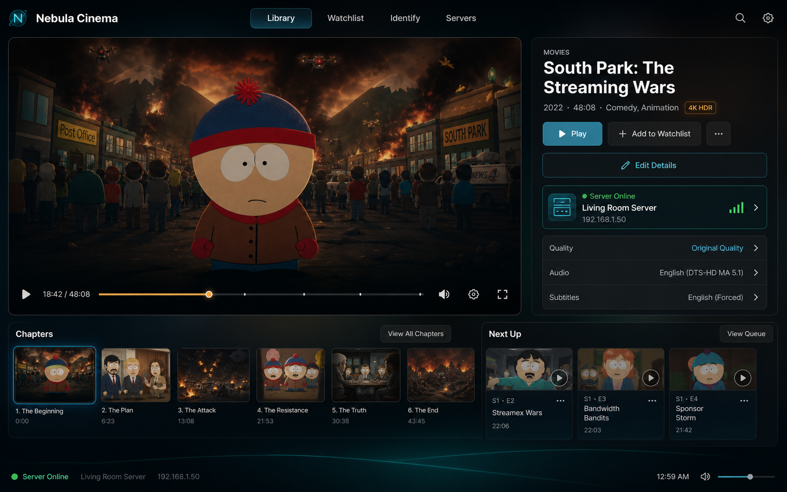
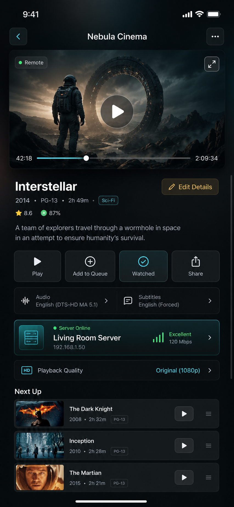

# Nebula Cinema Design Direction

Nebula Cinema should feel like a dedicated media product inside Nebula, not a
generic dashboard app with video controls. It can share Nebula's dark system
language, but it needs its own navigation, pacing, density, and media-first
surface.

Reference concepts:





The images are concept art, not literal implementation specs. Treat their movie
art, titles, and thumbnails as placeholders. The implementation should render
real imported metadata and local/remote media state.

## Product Intent

Cinema is the app for watching, identifying, editing, and organizing video
content. It should behave like a native media client connected to a Nebula
server.

Core jobs:

- Browse local and remote library content.
- Open a title into a full Cinema-specific title detail view.
- Edit every imported movie/show property without leaving Cinema.
- Play media with clear full-screen controls.
- Show server connection state and playback quality at all times.
- Support desktop, iOS, and eventually TV/controller surfaces.

## Visual Language

Cinema should be darker, quieter, and more cinematic than the main dashboard.
The main dashboard is an app launcher; Cinema is a media room.

Use:

- Near-black canvas with soft teal and amber ambient light.
- Large media art or video preview as the dominant object.
- Glass panels with subtle borders, not heavy cards everywhere.
- Cyan focus rings for selected/interactive media elements.
- Amber only for progress, quality, and active playback emphasis.
- White primary type and muted slate secondary type.
- Green server health indicators for online/healthy states.

Avoid:

- The main dashboard side rail inside Cinema.
- Marketing-page hero sections.
- Text that explains how the UI works.
- Dense settings panels in the watch surface.
- Bright multi-color gradients or one-note blue/purple palettes.
- Nested cards.

## Desktop Layout

Desktop Cinema should use a full-screen app surface with its own top navigation.
Do not reuse the generic dashboard window header.

Suggested structure:

```text
Cinema Shell
  Top bar
    Brand mark / Nebula Cinema
    Library | Watchlist | Identify | Servers
    Search
    Settings

  Main content
    Left: large player / preview / poster-backdrop area
    Right: title detail panel

  Lower content
    Chapters row
    Next Up queue

  Footer status
    Server Online
    Server name / address
    Current time
    Volume
```

The left player region should take roughly two thirds of the viewport. The
right detail panel should contain title metadata, primary actions, edit affordance,
server status, quality, audio, and subtitles.

Desktop primary actions:

- Play
- Add to Watchlist or Queue
- More menu
- Edit Details
- Fullscreen

Desktop title detail fields:

- Title
- Media type
- Year
- Runtime
- Genres
- Rating
- Poster/backdrop
- Match/identify status
- Server source
- Playback quality
- Audio track
- Subtitle track

## iOS Layout

iOS should use a portrait-native title/player detail screen. It should fit the
important controls in one useful view, while allowing vertical scrolling for
secondary content when needed.

Suggested structure:

```text
iOS Cinema Detail
  Safe-area top bar
    Back
    Nebula Cinema
    More

  Player preview
    Remote/local chip
    Fullscreen
    Center play
    Timeline

  Title metadata
    Title
    Year / rating / runtime / genre
    Edit Details
    Ratings / match confidence

  Action grid
    Play
    Add to Queue
    Watched
    Share

  Playback controls
    Audio
    Subtitles

  Server card
    Server Online
    Server name
    Address
    Signal / throughput

  Quality row
    Playback Quality

  Next Up queue
```

iOS must respect `viewport-fit=cover` and CSS safe-area insets. Avoid browser-like
scrollbars. If content must scroll, it should feel like a native detail screen,
not a web page.

## Player Overlay

The player overlay should be sparse and temporary. During playback, content is
the product.

Overlay elements:

- Center play/pause affordance.
- Bottom timeline with chapter ticks.
- Elapsed and remaining time.
- Rewind/forward skip buttons.
- Previous/next chapter or item.
- Audio and subtitles controls.
- Quality/original-quality badge.
- Server online/offline chip.
- Compact title metadata drawer.
- Next-up affordance.

Controls should fade or minimize when inactive. Use large targets on iOS and
controller-friendly focus states on desktop/TV.

## Metadata Editing

Editing should be built into Cinema, not hidden in a generic settings panel.

Recommended desktop pattern:

- `Edit Details` opens a right-side editor drawer or modal over the detail panel.
- Keep the player/title context visible where possible.
- Save/cancel actions should be explicit.
- Show the source of the current metadata match.

Recommended iOS pattern:

- `Edit Details` opens a full-height sheet.
- Group fields into Overview, Artwork, Technical, and Matching.
- Keep the title and poster visible at the top of the sheet.

Fields to support:

- Title
- Sort title
- Original title
- Media type
- Release year/date
- Runtime
- Rating/certification
- Genres
- Summary
- Poster
- Backdrop
- Season/episode info for shows
- External IDs/match candidates
- File path/source
- Playback defaults for audio/subtitles

## Server Information

Server presence is part of the Cinema identity because iOS and future native
clients will often connect to a remote Nebula server.

Show server state in both desktop and iOS:

- Online/offline
- Server name
- Server address
- Local/remote mode
- Quality/original/transcode state
- Throughput or signal quality when available
- Auth/token state in Settings or Servers

The server card should be actionable. Tapping or clicking it should open server
details, connection test, and pairing/auth controls.

## Implementation Plan

### 1. Split Cinema From Generic App Window

Create a Cinema shell renderer that does not use the normal `app-window` chrome.
The existing `renderCinemaView` can evolve into:

```text
src/cinema/
  renderCinemaShell.ts
  renderCinemaLibrary.ts
  renderCinemaTitleDetail.ts
  renderCinemaPlayer.ts
  renderCinemaMetadataEditor.ts
  cinemaState.ts
```

Keep DOM rendering framework-free unless the whole app migrates deliberately.

### 2. Add Cinema View State

Cinema needs its own state machine:

```text
library
title-detail
player
metadata-editor
servers
identify
```

State should include:

- selected media item
- active tab
- playback mode
- selected audio/subtitle
- server info
- edit draft
- pending save/test status

### 3. Introduce Shared Cinema Components

Build small deterministic render helpers:

- `renderCinemaTopNav`
- `renderServerCard`
- `renderTitleHero`
- `renderPlaybackControls`
- `renderChapterStrip`
- `renderNextUpQueue`
- `renderMetadataEditor`
- `renderQualityRow`

These helpers should return HTML strings and be paired with binder functions for
events, matching the current codebase pattern.

### 4. Desktop CSS

Add Cinema-specific classes rather than overloading dashboard classes:

```text
.cinema-shell
.cinema-top-nav
.cinema-player-layout
.cinema-player-frame
.cinema-title-panel
.cinema-server-card
.cinema-chapter-strip
.cinema-next-up
.cinema-editor-sheet
```

Desktop target:

- Full viewport.
- No dashboard side rail.
- Two-column player/detail layout.
- Chapters and next-up below.
- Footer server status.

### 5. iOS CSS

Use the same semantic markup where possible, but switch layout with media
queries:

- Player first.
- Metadata second.
- Action grid.
- Audio/subtitle rows.
- Server card.
- Next-up queue.

iOS constraints:

- Respect safe areas.
- No visible scrollbars.
- Touch targets at least 44px.
- Avoid tiny text in buttons.
- Do not let title metadata collide with the player.

### 6. API Needs

Current Cinema APIs are enough for a prototype, but full implementation needs:

- `GET /api/server/info`
- `GET /api/cinema/library`
- `PATCH /api/cinema/metadata`
- `POST /api/cinema/identify`
- Future playback/session endpoint for progress and queue state.

The client should treat server URL and auth token as runtime configuration,
especially on iOS.

### 7. Verification

For every Cinema UI pass:

```sh
docker compose run --rm dashboard npm run check
test ! -d node_modules && test ! -d dist && echo "host clean"
```

Browser checks:

- Desktop Cinema opens without generic dashboard chrome.
- Desktop layout fits at common laptop widths.
- iOS simulator respects safe areas.
- Player controls are reachable.
- Edit Details opens and saves a draft safely.
- Server card shows connection state.
- No visible scrollbars unless a detail surface intentionally scrolls.

## Implementation Notes For Future Agents

- Preserve user media data. Do not delete or rewrite imported metadata unless
  the user explicitly confirms a destructive operation.
- Keep Cinema visually separate from dashboard shell components.
- Prefer existing TypeScript/string-render patterns before adding a framework.
- Use real API data where available. Mock only the specific field that does not
  exist yet, and mark it clearly in code.
- Keep generated concept art in docs only; do not ship it as product artwork.
- The concept images contain placeholder titles and imagery. Do not hard-code
  those into production UI.
