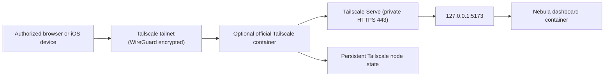

# Optional Tailscale Serve Deployment Plan

## Purpose

This document is the implementation handoff for adding optional Tailscale Serve
access to Nebula Dashboard. It is intended for an agent working in an isolated
Git worktree.

The revised product decision is intentionally simple:

- Tailscale is configured when the deployment is started with Docker Compose.
- There is no Nebula Settings UI for enabling, enrolling, or administering
  Tailscale.
- There is no runtime host reconciliation agent.
- The normal deployment remains unchanged when the Tailscale option is not
  selected.
- Tailscale provides private transport and tailnet access control; Nebula
  accounts remain required.

## Desired operator experience

Normal private-loopback deployment:

```sh
docker compose --env-file .env -f compose.deploy.yaml up -d --build
```

Optional Tailscale deployment:

```sh
docker compose --env-file .env -f compose.deploy.yaml \
  --profile tailscale up -d --build
```

The Tailscale profile should create a persistent tailnet node and privately
serve Nebula at a URL resembling:

```text
https://nebula.<tailnet-name>.ts.net
```

The service must not be reachable from the public internet and must never use
Tailscale Funnel.

## Recommended architecture

Use the official Tailscale container as an optional Compose service. Keep it
separate from the Nebula image.



For the current single-host Linux deployment, the least disruptive candidate is
an optional Tailscale service using host networking. Nebula retains its existing
loopback-only published port. The Tailscale container can then proxy
`http://127.0.0.1:5173` without changing the dashboard container's network
namespace.

This choice must be validated on the supported Linux host before it is finalized.
Host networking allows the official Tailscale container to reach other host
services, so the image must be pinned and the tradeoff documented.

If host-network userspace Serve does not work reliably, use a dedicated
`compose.deploy.tailscale.yaml` overlay that places the dashboard in the
Tailscale service's network namespace. Do not silently fall back to publishing
Nebula on `0.0.0.0`.

## Existing Nebula fit

Nebula is already close to the desired network shape:

- `compose.deploy.yaml` publishes the app on
  `${NEBULA_BIND_ADDRESS:-127.0.0.1}:${NEBULA_PORT:-5173}`.
- `server/dev.mjs` accepts exact additional Vite hostnames through
  `NEBULA_VITE_ALLOWED_HOSTS`.
- Browser clients normally use same-origin API requests.
- Capacitor accepts a configured Server URL and stores native account sessions
  in the Keychain, scoped by that URL.
- Cinema and Studio use normal byte ranges, HLS assets, and narrow media tickets.
- Files uses streaming and resumable uploads.
- Deployment already defaults `NEBULA_AUTH_ALLOW_LOCALHOST=false` and
  `NEBULA_FIRST_RUN_GUEST_ENABLED=false`.

Relevant files:

- `compose.deploy.yaml`
- `.env.example`
- `server/dev.mjs`
- `server/auth.mjs`
- `scripts/nebula-server.sh`
- `tests/nebula-server-cli.test.mjs`
- `src/api/http.ts`
- `docs/deployment.md`
- `docs/mobile-clients.md`
- `docs/accounts.md`
- `docs/testing.md`

## Tailscale behavior confirmed during design

- Tailscale Serve exposes a local service only within a tailnet. Funnel is the
  separate public feature.
- The official Docker image supports persistent state through `TS_STATE_DIR`.
- `TS_AUTH_ONCE=true` avoids unnecessary reauthentication when persistent state
  already contains a valid node identity.
- `TS_HOSTNAME` gives the container a stable tailnet machine name.
- `TS_SERVE_CONFIG` accepts a mounted Serve configuration file. Tailscale says
  the containing directory, rather than only the file, must be mounted so the
  container can detect updates.
- Userspace networking is the container default. It requires fewer privileges
  but has lower performance. Kernel networking is faster but requires
  `/dev/net/tun` and added network capabilities.
- Tailscale HTTPS certificates publish the machine FQDN in Certificate
  Transparency logs. The machine name must not contain sensitive information.
- Tailnet Grants apply to Serve traffic.
- Tailscale traffic is end-to-end WireGuard encrypted, including DERP-relayed
  traffic.

Current official references:

- [Tailscale Docker parameters](https://tailscale.com/docs/features/containers/docker/docker-params)
- [Docker Compose guide](https://tailscale.com/docs/features/containers/docker/how-to/connect-docker-container)
- [Tailscale Serve](https://tailscale.com/docs/features/tailscale-serve)
- [Serve CLI reference](https://tailscale.com/docs/reference/tailscale-cli/serve)
- [Tailscale Grants](https://tailscale.com/docs/reference/syntax/grants)
- [HTTPS certificate considerations](https://tailscale.com/docs/how-to/set-up-https-certificates)
- [Tailscale encryption](https://tailscale.com/docs/concepts/tailscale-encryption)

Recheck the official Docker and Serve documentation immediately before
implementation. Serve configuration formats and CLI behavior have changed
between Tailscale releases.

## Proposed Compose configuration

Add an optional `tailscale` service to `compose.deploy.yaml` behind a Compose
profile. The following is a design sketch, not copy-ready configuration:

```yaml
services:
  dashboard:
    # Existing service remains the default deployment.
    environment:
      NEBULA_EXTERNAL_HTTPS: "${NEBULA_EXTERNAL_HTTPS:-false}"
      NEBULA_VITE_HMR: "${NEBULA_VITE_HMR:-false}"

  tailscale:
    profiles: ["tailscale"]
    image: "${NEBULA_TAILSCALE_IMAGE:?set a reviewed pinned Tailscale image}"
    hostname: "${NEBULA_TAILSCALE_HOSTNAME:-nebula}"
    network_mode: host
    restart: unless-stopped
    environment:
      TS_AUTH_ONCE: "true"
      TS_AUTHKEY: "${NEBULA_TAILSCALE_AUTHKEY:-}"
      TS_HOSTNAME: "${NEBULA_TAILSCALE_HOSTNAME:-nebula}"
      TS_SERVE_CONFIG: /config/serve.json
      TS_STATE_DIR: /var/lib/tailscale
      TS_USERSPACE: "${NEBULA_TAILSCALE_USERSPACE:-true}"
    volumes:
      - type: bind
        source: ${NEBULA_TAILSCALE_STATE_PATH:?set state path}
        target: /var/lib/tailscale
      - type: bind
        source: ${NEBULA_TAILSCALE_CONFIG_PATH:?set config directory}
        target: /config
        read_only: true
```

Do not use `latest`. Select and test a specific version or digest, then make the
reviewed value the documented default. Updates should be deliberate and should
follow Nebula's existing backup/rehearsal workflow.

### Networking proof required

Before committing the final topology, prove that the official container can:

1. run with `TS_USERSPACE=true` and `network_mode: host` on the recommended
   Linux deployment host;
2. load the mounted Serve configuration;
3. terminate private HTTPS;
4. proxy to `http://127.0.0.1:5173`;
5. preserve range requests, streaming responses, uploads, and HLS behavior;
6. restart while preserving the same tailnet node identity.

If userspace performance is insufficient for media, add a separately documented
kernel-networking option. It must be opt-in and limited to the Tailscale service:

```yaml
environment:
  TS_USERSPACE: "false"
devices:
  - /dev/net/tun:/dev/net/tun
cap_add:
  - NET_ADMIN
  - NET_RAW
```

Do not make the dashboard privileged. Do not add `SYS_ADMIN` unless the reviewed
current Tailscale documentation and a demonstrated platform requirement make it
unavoidable.

### Alternative shared-network overlay

If host networking is rejected, use a separate overlay file and share the
Tailscale network namespace:

```yaml
services:
  tailscale:
    # Owns the network namespace and optional loopback host publication.

  dashboard:
    network_mode: service:tailscale
    depends_on:
      tailscale:
        condition: service_healthy
```

The dashboard's base `ports` entry must be removed in this topology because
Docker does not allow port publishing on a service that borrows another
service's network namespace. Verify the Compose merge/reset syntax supported by
the repository's required Compose version; do not assume `ports: []` removes a
base mapping.

## Serve configuration

Store a reviewed Serve configuration template in a dedicated directory, for
example:

```text
deploy/tailscale/serve.json
```

Generate the initial schema with the pinned Tailscale version and verify it by
round-tripping through `tailscale serve status --json`. The required semantics
are fixed:

```text
private HTTPS :443, path / -> http://127.0.0.1:5173
Funnel explicitly false
```

The known container configuration shape has historically resembled:

```json
{
  "TCP": {
    "443": { "HTTPS": true }
  },
  "Web": {
    "${TS_CERT_DOMAIN}:443": {
      "Handlers": {
        "/": { "Proxy": "http://127.0.0.1:5173" }
      }
    }
  },
  "AllowFunnel": {
    "${TS_CERT_DOMAIN}:443": false
  }
}
```

Do not copy this example without validating it against the pinned image. The
Tailscale documentation specifically recommends exporting the current format
with `tailscale serve status --json`.

The configuration must contain no operator-supplied arbitrary proxy target,
path, command, or executable. Nebula's target is always loopback and the fixed
internal application port.

## Deployment environment

Extend `.env.example` and `docs/deployment.md` with an optional section similar
to:

```env
# Optional Tailscale Compose profile. Leave unset for the normal deployment.
NEBULA_TAILSCALE_IMAGE=tailscale/tailscale:<reviewed-version-or-digest>
NEBULA_TAILSCALE_HOSTNAME=nebula
NEBULA_TAILSCALE_STATE_PATH=/srv/nebula/tailscale/state
NEBULA_TAILSCALE_CONFIG_PATH=/srv/nebula/tailscale/config
NEBULA_TAILSCALE_AUTHKEY=
NEBULA_TAILSCALE_USERSPACE=true

# Exact HTTPS hostname after the node joins the tailnet.
NEBULA_VITE_ALLOWED_HOSTS=nebula.<tailnet-name>.ts.net
NEBULA_EXTERNAL_HTTPS=true
NEBULA_VITE_HMR=false
```

The auth key is a bootstrap secret, not a normal long-term application setting.
The implementation should prefer a Compose secret/file if the pinned Tailscale
container supports it correctly. If `TS_AUTHKEY` must temporarily come from the
mode-0600 deployment `.env`, document the exposure in Docker container metadata,
use a narrowly tagged key, persist node state, and remove the key from `.env`
after successful enrollment and restart verification.

Never commit the auth key, OAuth secret, Tailscale state directory, `.env`, or a
rendered Compose configuration containing secrets. Add the chosen state/config
paths to backup and protection guidance. Tailscale state contains the node's
private identity and must be protected as a credential; it should not be placed
in `content/`.

## Secure browser cookies

`server/auth.mjs` currently marks browser session cookies `Secure` only when
`request.socket.encrypted` is true. Serve terminates HTTPS before proxying over
HTTP, so the backend does not see an encrypted socket.

Add an explicit deployment setting:

```env
NEBULA_EXTERNAL_HTTPS=true
```

Cookie creation should use:

```js
const secure = Boolean(request.socket.encrypted)
  || process.env.NEBULA_EXTERNAL_HTTPS === "true";
```

Cookie clearing must use the same attributes. Add tests for cookie creation,
rotation, and clearing.

Do not generically trust `X-Forwarded-Proto`. The explicit setting avoids making
an untrusted forwarded header a security boundary.

## Vite and external hostname behavior

Set `NEBULA_VITE_ALLOWED_HOSTS` to the one exact Tailscale FQDN. Do not allow all
`.ts.net` names, `*`, or Vite's unrestricted host mode.

The deployed server embeds Vite middleware and currently pins HMR to
`127.0.0.1`. Remote clients do not need HMR. Add and test:

```env
NEBULA_VITE_HMR=false
```

Development Compose keeps HMR. Deployment Compose disables it. A future static
production frontend is desirable but is not required for the initial Tailscale
feature.

Tailscale prevents public access; it does not conceal frontend JavaScript from
an authorized browser. Server source, SQLite state, media, and the container
filesystem remain private.

## Authentication and proxy trust

Tailscale is an outer network-access layer, not a replacement for Nebula auth:

```text
Tailnet Grant
    +
Nebula account/session
    +
Nebula owner/member permissions and library grants
```

Do not consume Tailscale identity headers in version one. Do not automatically
create Nebula users based on tailnet identity.

These deployment settings must remain conservative:

```env
NEBULA_BIND_ADDRESS=127.0.0.1
NEBULA_AUTH_ALLOW_LOCALHOST=false
NEBULA_FIRST_RUN_GUEST_ENABLED=false
```

Serve's backend connection appears local to Nebula. Guest mode must remain off
or remote tailnet clients could be treated as locally eligible guests during
first-run setup.

## Tailnet policy

Document a least-privilege policy example, but do not attempt to edit tailnet
policy from Compose or Nebula.

Representative Grants shape:

```json
{
  "groups": {
    "group:nebula-users": [
      "alice@example.com",
      "bob@example.com"
    ]
  },
  "tagOwners": {
    "tag:nebula": ["autogroup:admin"]
  },
  "grants": [
    {
      "src": ["group:nebula-users"],
      "dst": ["tag:nebula"],
      "ip": ["tcp:443"]
    }
  ]
}
```

Validate the example with the current policy validator. Existing permissions
are additive, so operators must review broad pre-existing Grants.

Use a generic machine name such as `nebula` before enabling HTTPS. Certificate
Transparency publicly records the certificate FQDN even though the service is
not publicly reachable.

## iOS and other clients

The iPhone uses the official Tailscale application and joins the same tailnet.
Nebula's runtime Client / Server URL becomes:

```text
https://nebula.<tailnet-name>.ts.net
```

The existing `capacitor://localhost` CORS origin remains applicable. Native
Nebula sessions continue to use Keychain-backed bearer tokens. Changing from a
LAN URL to the Tailscale URL intentionally clears the old URL-scoped native
session and requires sign-in again.

Do not embed a VPN engine or Apple Network Extension in the Capacitor app as part
of this work.

## Operator CLI changes

Update `scripts/nebula-server.sh` without changing its no-clobber behavior.

Suggested option:

```text
--tailscale          Include the optional Tailscale Compose profile
```

Or support an environment equivalent:

```env
NEBULA_SERVER_TAILSCALE=true
```

All lifecycle commands must consistently include or omit `--profile tailscale`:

- install/init validation;
- up/start;
- status;
- logs;
- update/upgrade;
- down/stop.

The CLI must not silently install Tailscale, generate an auth key, edit Grants,
disable key expiry, enable HTTPS for the tailnet, or use Funnel. It should
validate required optional paths and variables before starting Compose and print
clear enrollment/status instructions.

`init` may create missing Tailscale state/config directories with conservative
permissions only when `--tailscale` was explicitly requested. It must never
overwrite an existing Serve configuration or `.env`.

After start, the CLI should display both:

- the existing local loopback URL;
- a command for inspecting the Tailscale container status and discovering the
  private HTTPS URL.

Do not parse and print sensitive raw status JSON.

## Security invariants

The feature is not complete unless all of these remain true:

1. The default deployment has no Tailscale service running.
2. Selecting the Tailscale profile is explicit.
3. Nebula stays loopback-bound.
4. No public inbound port or router forwarding is required.
5. No configuration enables Funnel.
6. Nebula accounts, CSRF, sessions, media tickets, roles, and library grants
   remain active.
7. Guest mode and the localhost service-token exemption remain disabled.
8. The dashboard image receives no Tailscale privileges or daemon socket.
9. Tailscale privileges, if kernel mode is selected, are limited to the
   Tailscale service.
10. Tailscale state and bootstrap credentials are never committed or logged.
11. The sidecar image is pinned to a reviewed version/digest.
12. A Tailscale outage affects private remote access but does not corrupt Nebula
    data or make local readiness fail.
13. No arbitrary proxy target or Serve configuration is accepted from the
    browser application.

## Testing plan

### Compose and CLI tests

Extend the fake-Docker pattern in `tests/nebula-server-cli.test.mjs`:

- default lifecycle commands do not include the Tailscale profile;
- explicit Tailscale lifecycle commands consistently include it;
- missing state/config/auth prerequisites fail before starting containers;
- initialization is no-clobber;
- paths with spaces remain correctly handled;
- status/log/down/update select the same profile as up;
- generated `.env` contains placeholders, never generated secrets;
- rendered configuration never uses `0.0.0.0` for the dashboard;
- no command contains `funnel`;
- host tree remains free of Tailscale state fixtures after tests.

### Server tests

- `NEBULA_EXTERNAL_HTTPS=true` adds `Secure` to login/setup/rotation cookies.
- Cookie clearing uses matching `Secure` attributes.
- The setting does not change CSRF or authorization behavior.
- Forwarded headers alone cannot enable the secure-cookie path.
- deployment HMR can be disabled without changing development behavior.
- exact Vite allowed-host behavior remains enforced.

### Real-tailnet verification

Use a deliberately isolated test tailnet and fresh/copied Nebula data:

- the node enrolls once and retains identity after Compose recreation;
- the Serve URL is HTTPS and tailnet-only;
- Funnel is explicitly off;
- an authorized device can connect;
- a device denied by the test Grant cannot connect;
- an ordinary public-internet request cannot connect;
- browser owner setup, sign-in, reload, sign-out, and CSRF work;
- browser cookies include `HttpOnly`, `SameSite=Lax`, and `Secure`;
- Files browse, small upload, 64 MB chunk upload, interrupted resume, and
  download work;
- Cinema direct play and seek preserve `206 Partial Content` behavior;
- remux, progressive HLS, resume, and quality switching work;
- Studio playback and resume work;
- iOS login, Keychain restore, logout, and Server URL change work;
- dashboard restart and Tailscale restart recover cleanly;
- media behavior is recorded for both direct and DERP-relayed paths;
- userspace throughput is measured before deciding whether kernel mode is
  needed.

Tailscale's public Serve documentation does not specify a fixed request-body
limit. Verify large uploads empirically rather than assuming unlimited proxy
behavior.

## Implementation phases

### Phase 1: proxy-safe application behavior

- Add explicit external-HTTPS/Secure-cookie support and tests.
- Add deployment HMR-off behavior.
- Preserve exact Vite allowed-host validation.
- Update environment documentation.

### Phase 2: optional Compose profile

- Pin and add the official Tailscale service.
- Add persistent state and Serve config directory handling.
- Add the reviewed Serve configuration with Funnel false.
- Preserve the normal deployment when the profile is absent.
- Add CLI profile selection and fake-Docker tests.

### Phase 3: real-tailnet proof

- Validate userspace host-network topology on the recommended Linux host.
- If it fails, implement and document the shared-network overlay.
- Verify enrollment, persistence, HTTPS, policy denial, media, and uploads.
- Measure direct and DERP throughput.
- Decide whether to offer opt-in kernel networking.

### Phase 4: documentation and hardening

- Finalize deployment, mobile-client, account, and testing documentation.
- Document key creation, tagging, rotation/removal, state protection, and
  Certificate Transparency.
- Add upgrade and rollback instructions for the pinned sidecar image.

## Acceptance criteria

- Running the normal Compose deployment behaves exactly as before.
- Tailscale starts only when explicitly selected.
- Nebula remains bound to loopback and has no public endpoint.
- The private endpoint uses Tailscale Serve HTTPS, never Funnel.
- Tailscale node identity persists across container recreation.
- Tailscale credentials and state are protected and untracked.
- Nebula authentication and permissions remain required.
- Browser cookies are Secure through Serve.
- Native clients work using the Tailscale Server URL.
- Range requests, HLS, and resumable uploads work through Serve.
- A Tailscale outage does not make the core Nebula service unready or damage
  application data.
- The sidecar image is pinned and all added privileges are isolated to it.
- All Docker checks and tests pass.
- The host worktree contains neither `node_modules` nor `dist`.

## Explicit non-goals

- Runtime Tailscale configuration in Nebula Settings.
- A Nebula host reconciliation agent.
- Public access through Tailscale Funnel.
- Automatic tailnet account creation, auth-key generation, or policy editing.
- Tailscale identity replacing Nebula accounts.
- Embedding a VPN engine in the iOS application.
- Arbitrary reverse-proxy configuration.
- Hiding frontend JavaScript from authorized clients.
- Migrating the entire deployed frontend from Vite to static assets.

## Worktree verification

Follow `AGENTS.md`; do not install project dependencies on the host. Isolate the
worktree Compose project and choose a free host port:

```sh
export COMPOSE_PROJECT_NAME=nebula-$(basename "$PWD")
export DASHBOARD_PORT=$(python3 - <<'PY'
import socket
with socket.socket() as s:
    s.bind(("127.0.0.1", 0))
    print(s.getsockname()[1])
PY
)

COMPOSE_PROJECT_NAME=$COMPOSE_PROJECT_NAME DASHBOARD_PORT=$DASHBOARD_PORT \
  docker compose run --rm dashboard npm run check
COMPOSE_PROJECT_NAME=$COMPOSE_PROJECT_NAME DASHBOARD_PORT=$DASHBOARD_PORT \
  docker compose run --rm dashboard npm test
test ! -d node_modules && test ! -d dist && echo "host clean"
```

Do not test the worktree on the main dashboard's port 5173. Do not touch or copy
the user's ignored `content/` media. Use generated small fixtures and isolated
data volumes for network QA.

## Handoff note

Before editing, read `AGENTS.md`, `docs/session-handoff.md`, `README.md`,
`docs/architecture.md`, `docs/deployment.md`, `docs/accounts.md`,
`docs/mobile-clients.md`, and `docs/testing.md`. Inspect the dirty worktree and
preserve unrelated user changes. Revalidate the pinned Tailscale Docker and
Serve behavior against current official documentation before committing the
Compose schema.
